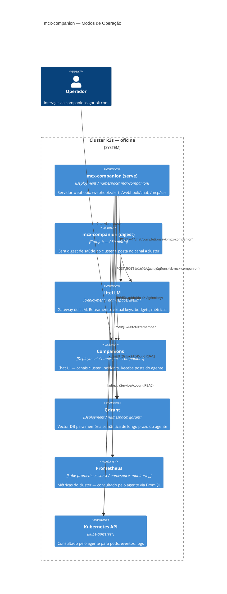

# Agents — mcx-companion

Documentação dos agentes autônomos que operam no cluster **oficina**.

---

## Visão Geral

O `mcx-companion` é um agente SRE autônomo que monitora e responde a eventos do cluster k3s. Roda como Deployment (webhook server) e CronJob (digest diário), usando LiteLLM como gateway para DeepSeek.



---

## Modos de Operação

### 1. Digest Diário (`mcx-companion digest`)

**Trigger:** CronJob `0 8 * * *` (08h00 diário)

**Fluxo:**
1. Coleta estado do cluster: `cluster_status`, `cluster_metrics_summary`, `recent_events`
2. LLM gera resumo estruturado (saúde, métricas, eventos, veredicto)
3. Posta no canal `cluster` via `companions /api/inbox`

**Output:** Markdown com emojis de status, máx 400 palavras.

---

### 2. Investigação de Alertas (`mcx-companion react`)

**Trigger:** `POST /webhook/alert` — chamado pelo Alertmanager (quando ativado)

**Fluxo:**
1. Recebe payload do Alertmanager (`ALERT_PAYLOAD` env)
2. Usa tools (logs, eventos, métricas) para investigar root cause
3. Posta diagnóstico no canal `incidents` com causa provável e ação recomendada
4. **Nunca executa mutações** — ações destrutivas são listadas como "requires human approval"

**Nota:** Alertmanager está desabilitado no `values.yaml` (`alertmanager.enabled: false`). Para ativar, setar `true` e configurar `alertmanagerConfig` apontando para `http://mcx-companion.mcx-companion.svc.cluster.local/webhook/alert`.

---

### 3. Chat Interativo (`mcx-companion serve` — `/webhook/chat`)

**Trigger:** Mensagem humana no canal do Companions (via `POST /webhook/chat`)

**Fluxo:**
1. Companions chama o webhook ao receber mensagem de usuário
2. Agente busca histórico do canal (últimas 20 mensagens)
3. Injeta memória semântica relevante (mem0 + Qdrant)
4. LLM responde com contexto do cluster atual (usa tools se necessário)
5. Posta resposta de volta no canal

---

### 4. MCP Server (`/mcp/sse`)

Expõe as tools do agente (`cluster_status`, `pod_logs`, `recent_events`, `cluster_metrics_summary`, `prometheus_query`) via protocolo MCP sobre SSE.

Endpoint: `https://mcx-companion.goriok.com/mcp/sse`

---

## Tools Disponíveis

| Tool | Descrição |
|------|-----------|
| `cluster_status` | Nós e pods não-running em todos os namespaces |
| `pod_logs` | Logs recentes de pods por label `app` e namespace |
| `recent_events` | Eventos Warning do cluster ou namespace específico |
| `cluster_metrics_summary` | CPU, memória, CrashLoopBackOff, jobs falhados (Prometheus) |
| `prometheus_query` | PromQL arbitrário instant query |

---

## Virtual Key LiteLLM

A key `vk-mcx-companion` tem os seguintes limites:

| Parâmetro | Valor |
|-----------|-------|
| Budget | $1/mês |
| RPM | 10 req/min |
| TPM | 100k tokens/min |
| Modelos | `deepseek-v4-flash` |

Gerenciar via: `mcx litellm budget show` / `mcx litellm budget edit`

---

## RBAC

O ServiceAccount `mcx-companion` tem `ClusterRole` read-only:

- `pods`, `nodes`, `services`, `endpoints`, `events`, `namespaces` — get, list, watch
- `pods/log` — get
- `deployments`, `replicasets`, `daemonsets`, `statefulsets` — get, list, watch
- `jobs`, `cronjobs` — get, list, watch

Sem permissões de escrita — o agente é observador, não executor.

---

## Memória

O agente usa [mem0](https://github.com/mem0ai/mem0) com Qdrant como vector store para memória semântica de longo prazo por canal (`memory_user = "channel:<canal>"`).

- **recall:** injeta memórias relevantes no system prompt antes de cada resposta
- **remember:** persiste o par (pergunta, resposta) após cada interação

Qdrant roda em `k8s/apps/qdrant` (sem ingress — acesso apenas interno via `qdrant.qdrant.svc.cluster.local:6333`).

---

## Manifests

```
k8s/apps/mcx-companion/
├── namespace.yaml
├── rbac.yaml              ← ServiceAccount + ClusterRole + ClusterRoleBinding
├── deployment.yaml        ← mcx-companion serve (port 8080)
├── service.yaml           ← ClusterIP :80 → :8080
├── ingress.yaml           ← mcx-companion.goriok.com
└── cronjob-digest.yaml    ← 0 8 * * * mcx-companion digest
```

Secret necessário no cluster:

```bash
kubectl create secret generic mcx-companion-secret \
  --namespace mcx-companion \
  --from-literal=LITELLM_API_KEY="sk-..." \
  --from-literal=COMPANIONS_AGENT_KEY="..." \
  --from-literal=COMPANIONS_URL="http://companions.companions.svc.cluster.local" \
  --from-literal=LITELLM_BASE_URL="http://litellm.litellm.svc.cluster.local/v1" \
  --from-literal=MODEL="deepseek-v4-flash"
```
