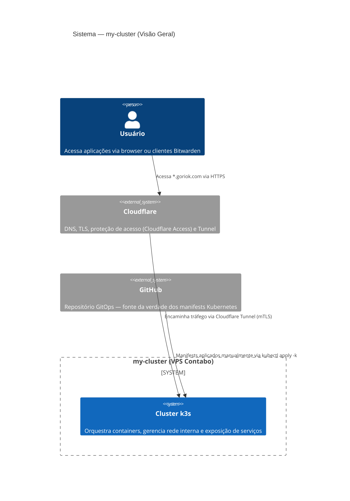
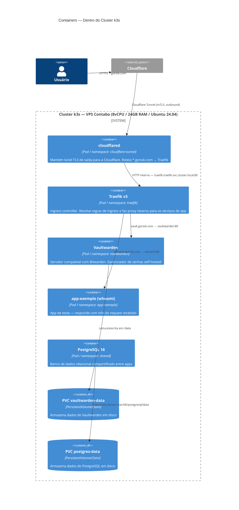
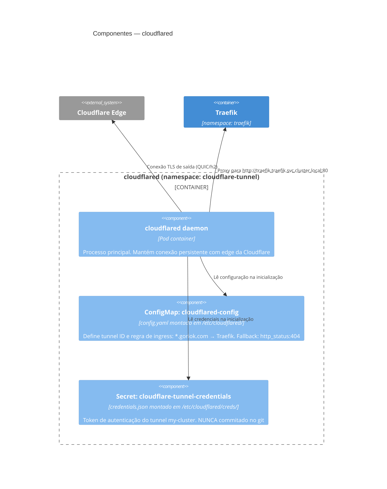
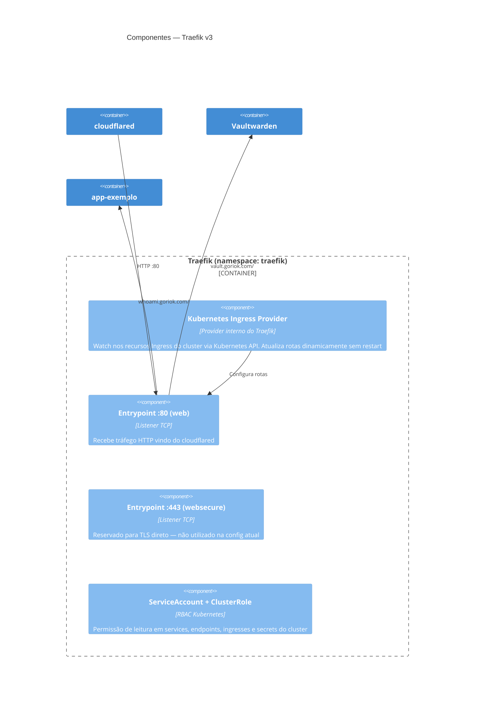
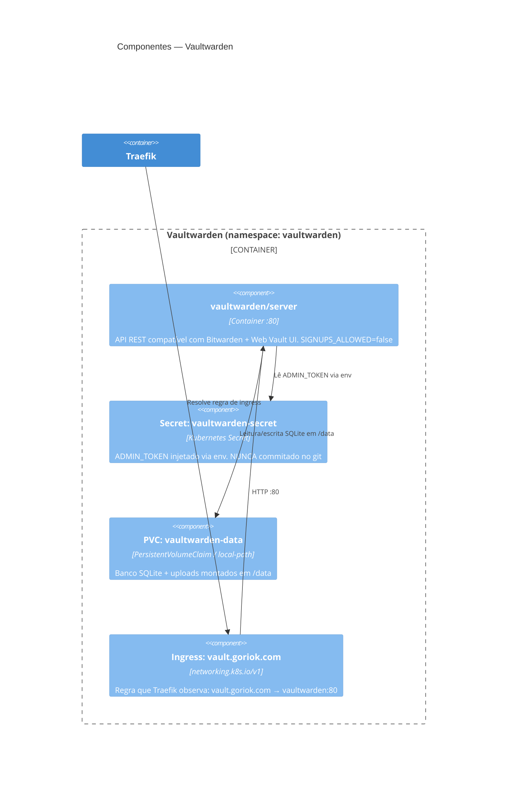
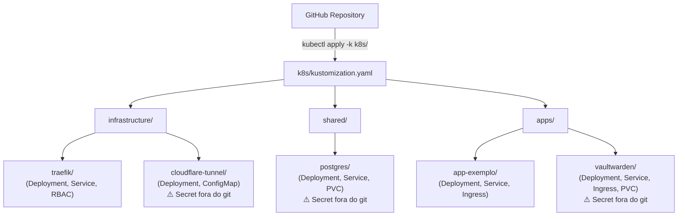
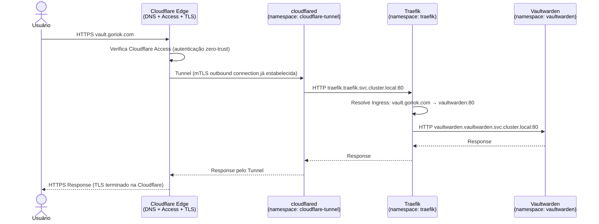

# Arquitetura do Cluster — C4 Model

Documentação da arquitetura do cluster k3s pessoal usando o [C4 Model](https://c4model.com/), com diagramas em Mermaid.

---

## Contexto do Sistema

O C4 Model organiza a arquitetura em 4 níveis de abstração: **Context → Containers → Components → Code**. Aqui usamos os 3 primeiros níveis (o nível de código é derivável diretamente dos manifests YAML).

---

## Nível 1 — Contexto do Sistema

Mostra o sistema como um todo e como ele se relaciona com atores externos e sistemas externos.



**Pontos-chave:**
- O VPS **não expõe nenhuma porta** para a internet. Todo tráfego entra pelo Cloudflare Tunnel (conexão de saída do cluster para a Cloudflare).
- **Cloudflare Access** protege todas as rotas `*.goriok.com` com autenticação zero-trust antes de chegar ao cluster.
- O GitOps é **pull manual** (sem ArgoCD/Flux ainda) — o operador aplica `kubectl apply -k k8s/` a partir do repositório.

---

## Nível 2 — Containers

Detalha os processos/serviços rodando dentro do cluster e como se comunicam.



**Pontos-chave:**
- `cloudflared` é o único ponto de entrada externo — abre conexão de **saída** para a Cloudflare, eliminando necessidade de abrir portas no firewall do VPS.
- **Traefik** observa os recursos `Ingress` do Kubernetes via RBAC e roteia dinamicamente sem restart.
- **PostgreSQL** fica no namespace `shared` para ser reutilizável por múltiplas apps — atualmente provisionado mas não conectado ao Vaultwarden (que usa SQLite por padrão via PVC).
- Todos os dados persistentes usam **PersistentVolumeClaim** com o storage class padrão do k3s (local-path).

---

## Nível 3 — Componentes

Detalha os componentes internos de cada container relevante.

### Componentes do Cloudflare Tunnel



### Componentes do Traefik



### Componentes do Vaultwarden



---

## Estrutura GitOps (Kustomize)

O repositório é a **fonte da verdade** de toda a configuração do cluster. Secrets nunca são commitados.

```
k8s/
├── kustomization.yaml          ← Entry point: kubectl apply -k k8s/
├── infrastructure/
│   ├── traefik/                ← Ingress controller (Deployment, Service, RBAC)
│   └── cloudflare-tunnel/      ← Tunnel daemon (Deployment, ConfigMap)
│                                  Secret: criado via kubectl (fora do git)
├── shared/
│   └── postgres/               ← PostgreSQL compartilhado (Deployment, Service, PVC)
│                                  Secret: criado via kubectl (fora do git)
└── apps/
    ├── app-exemplo/            ← whoami — app de teste/validação
    └── vaultwarden/            ← Gerenciador de senhas (Deployment, Service, Ingress, PVC)
                                   Secret: criado via kubectl (fora do git)
```



---

## Fluxo de Requisição

Caminho completo de uma requisição do usuário até a aplicação:



---

## Decisões Arquiteturais

| Decisão | Escolha | Motivação |
|---|---|---|
| Exposição de serviços | Cloudflare Tunnel (zero porta aberta) | Zero trust networking — VPS sem surface de ataque direta |
| TLS | Terminado na Cloudflare Edge | Certificado gerenciado automaticamente pelo Cloudflare Free |
| Ingress controller | Traefik v3 | Leve, dinâmico via Kubernetes Ingress nativo, sem CRDs extras |
| GitOps engine | Kustomize (manual) | Simplicidade — sem overhead de ArgoCD/Flux na fase inicial |
| Secrets | kubectl direto no cluster | Nunca expostos no git; sem Vault/Sealed Secrets na v0 |
| Storage | local-path (k3s default) | Single-node — sem necessidade de storage distribuído |
| Banco compartilhado | PostgreSQL no namespace `shared` | Reutilizável entre apps sem um banco por app |
