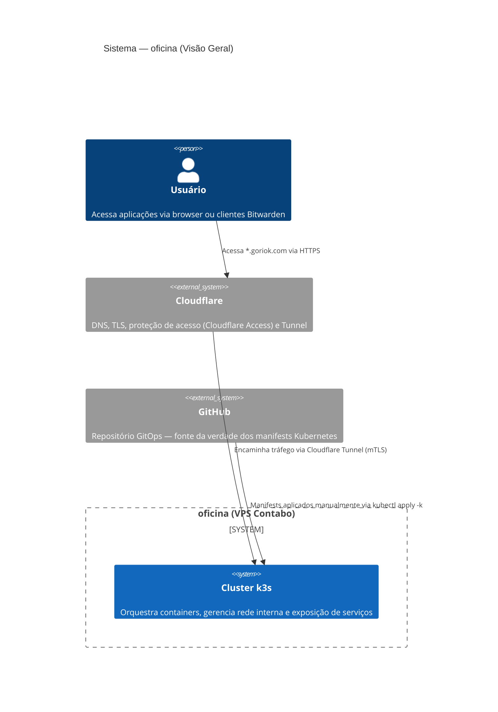
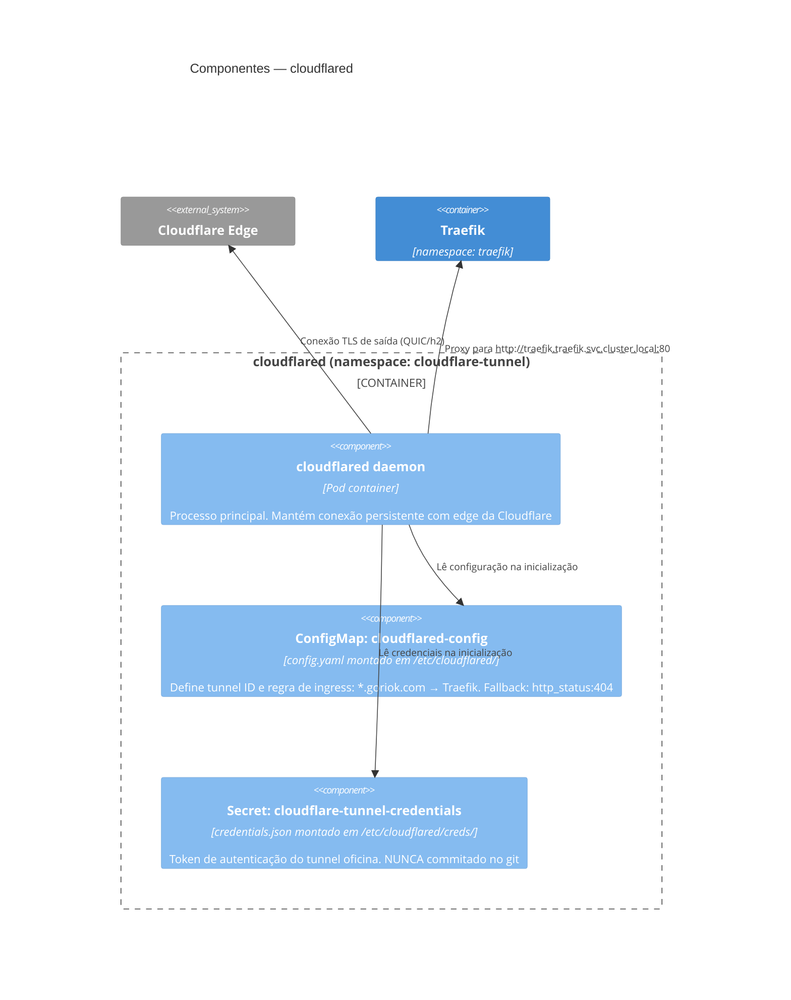
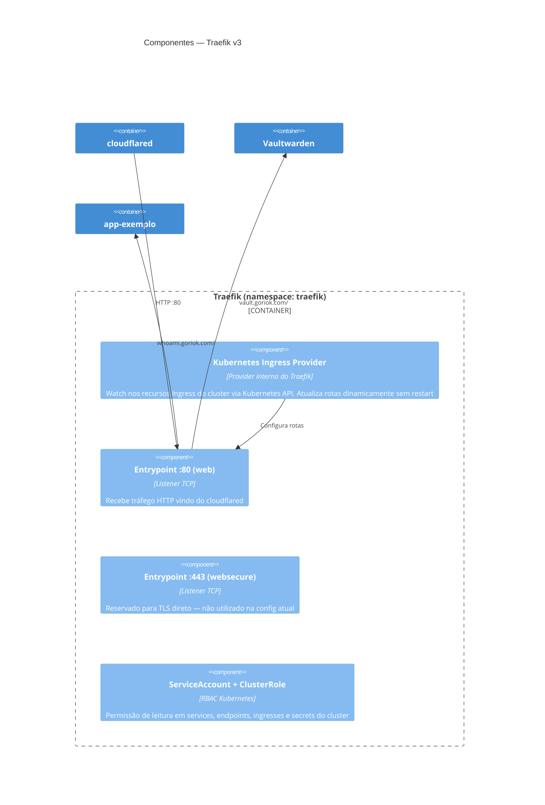
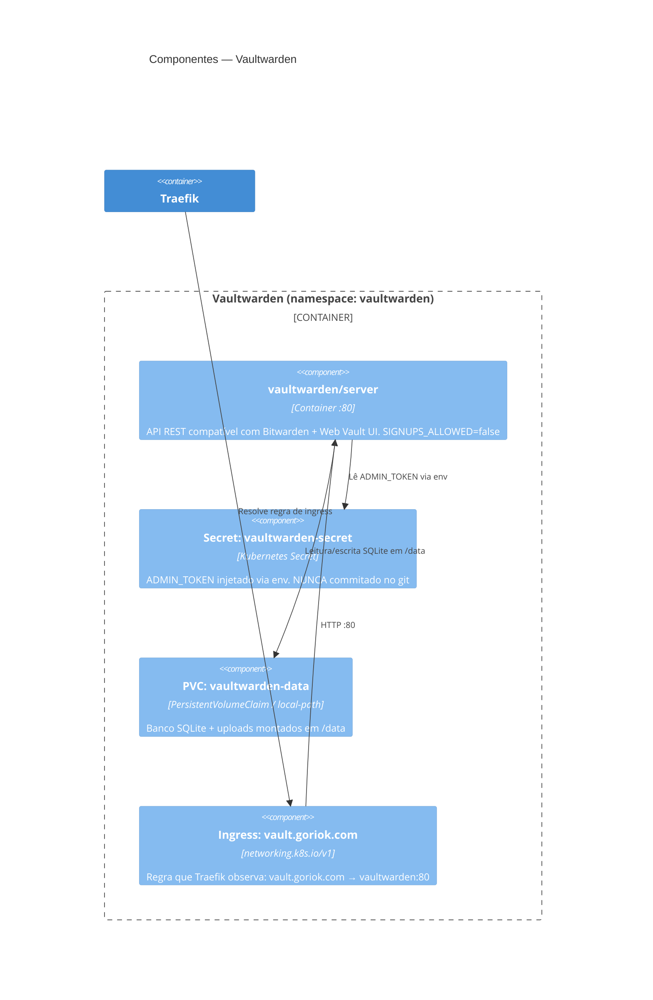
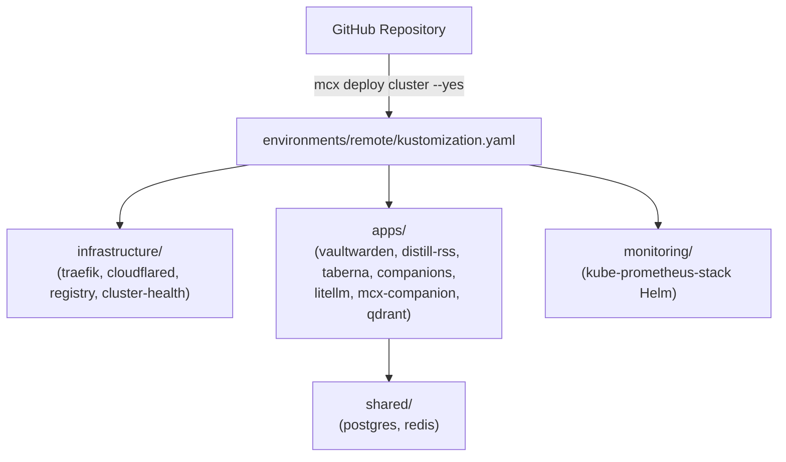
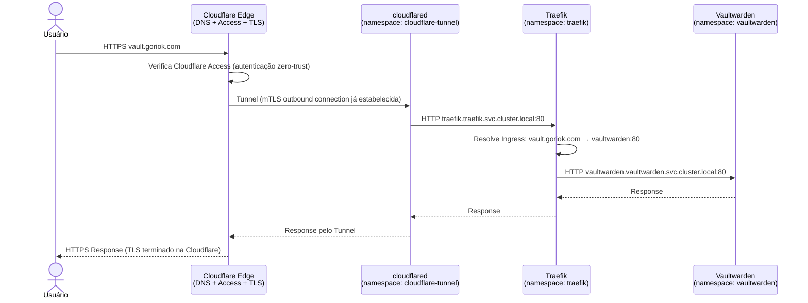

# Arquitetura do Cluster — C4 Model

Documentação da arquitetura do cluster k3s pessoal usando o [C4 Model](https://c4model.com/), com diagramas em Mermaid.

---

## Contexto do Sistema

O C4 Model organiza a arquitetura em 4 níveis de abstração: **Context → Containers → Components → Code**. Aqui usamos os 3 primeiros níveis (o nível de código é derivável diretamente dos manifests YAML).

---

## Nível 1 — Contexto do Sistema

Mostra o sistema como um todo e como ele se relaciona com atores externos e sistemas externos.


```mermaid
C4Context
    title Sistema — oficina (Visão Geral)

    Person(user, "Usuário", "Acessa aplicações via browser ou clientes Bitwarden")

    System_Boundary(cluster, "oficina (VPS Contabo)") {
        System(k3s, "Cluster k3s", "Orquestra containers, gerencia rede interna e exposição de serviços")
    }

    System_Ext(cloudflare, "Cloudflare", "DNS, TLS, proteção de acesso (Cloudflare Access) e Tunnel")
    System_Ext(github, "GitHub", "Repositório GitOps — fonte da verdade dos manifests Kubernetes")

    Rel(user, cloudflare, "Acessa *.goriok.com via HTTPS")
    Rel(cloudflare, k3s, "Encaminha tráfego via Cloudflare Tunnel (mTLS)")
    Rel(github, k3s, "Manifests aplicados manualmente via kubectl apply -k")
```

**Pontos-chave:**
- O VPS **não expõe nenhuma porta** para a internet. Todo tráfego entra pelo Cloudflare Tunnel (conexão de saída do cluster para a Cloudflare).
- **Cloudflare Access** protege todas as rotas `*.goriok.com` com autenticação zero-trust antes de chegar ao cluster.
- O GitOps é **pull manual** (sem ArgoCD/Flux ainda) — o operador aplica `kubectl apply -k k8s/` a partir do repositório.

---

## Nível 2 — Containers

Detalha os processos/serviços rodando dentro do cluster e como se comunicam.


```mermaid
C4Container
    title Containers — Dentro do Cluster k3s

    Person(user, "Usuário")
    System_Ext(cloudflare, "Cloudflare")
    System_Ext(deepseek, "DeepSeek API")

    System_Boundary(cluster, "Cluster k3s — VPS Contabo (8vCPU / 24GB RAM / Ubuntu 24.04)") {

        Container(cloudflared, "cloudflared", "Pod / namespace: cloudflare-tunnel", "Mantém túnel TLS de saída para a Cloudflare. Roteia *.goriok.com → Traefik")
        Container(traefik, "Traefik v3", "Pod / namespace: traefik", "Ingress controller. Resolve regras de Ingress e faz proxy reverso para os serviços de app")

        Container(vaultwarden, "Vaultwarden", "Pod / namespace: vaultwarden", "Gerenciador de senhas self-hosted — compatível com Bitwarden")
        Container(distill, "distill-rss", "Pod + CronJobs / namespace: distill-rss", "Monitor de mudanças em feeds RSS com análise LLM")
        Container(taberna, "Taberna", "Pod / namespace: taberna", "App de debates filosóficos com múltiplos filósofos LLM em paralelo")
        Container(companions, "Companions", "Pod / namespace: companions", "Chat UI — canais cluster e incidents. Recebe posts do mcx-companion")
        Container(mcx_companion, "mcx-companion", "Deployment + CronJob / namespace: mcx-companion", "Agente SRE autônomo. Digest diário + webhook de alertas + chat")
        Container(litellm, "LiteLLM", "Pod / namespace: litellm", "Gateway LLM: virtual keys, budgets, rate limits, métricas Prometheus")
        Container(postgres, "PostgreSQL 16", "Pod / namespace: shared", "Banco relacional compartilhado: litellm, taberna, companions, distill-rss")
        Container(redis, "Redis", "Pod / namespace: shared", "Cache compartilhado")
        Container(qdrant, "Qdrant", "Pod / namespace: qdrant", "Vector DB para memória semântica do mcx-companion (mem0)")
        Container(registry, "Registry", "Pod / namespace: registry", "Registry de imagens Docker interno — imagens das apps customizadas")
        Container(monitoring, "kube-prometheus-stack", "namespace: monitoring", "Prometheus + Grafana + node-exporter + kube-state-metrics")
    }

    Rel(user, cloudflare, "HTTPS *.goriok.com")
    Rel(cloudflare, cloudflared, "Cloudflare Tunnel (mTLS, outbound)")
    Rel(cloudflared, traefik, "HTTP → traefik.traefik.svc.cluster.local:80")
    Rel(traefik, vaultwarden, "vault.goriok.com")
    Rel(traefik, taberna, "taberna.goriok.com")
    Rel(traefik, companions, "companions.goriok.com")
    Rel(traefik, mcx_companion, "mcx-companion.goriok.com")
    Rel(taberna, litellm, "vk-taberna")
    Rel(distill, litellm, "vk-distill-rss")
    Rel(mcx_companion, litellm, "vk-mcx-companion")
    Rel(litellm, deepseek, "deepseek-v4-flash / deepseek-v4-pro")
    Rel(litellm, postgres, "DATABASE_URL")
    Rel(mcx_companion, companions, "POST /api/inbox")
    Rel(mcx_companion, qdrant, "mem0 recall/remember")
    Rel(mcx_companion, monitoring, "PromQL queries")
```

**Pontos-chave:**
- `cloudflared` é o único ponto de entrada externo — sem portas abertas no VPS.
- **LiteLLM** centraliza todo acesso a LLMs com virtual keys por app, budgets mensais e rate limits.
- **PostgreSQL** no namespace `shared` é reutilizado por litellm, taberna, companions e distill-rss.
- **mcx-companion** é o agente SRE autônomo — veja [`docs/agents.md`](agents.md) para detalhes.
- O monitoring usa `kube-prometheus-stack` via Helm (chart vendored em `k8s/environments/remote/monitoring/`).

---

## Nível 3 — Componentes

Detalha os componentes internos de cada container relevante.

### Componentes do Cloudflare Tunnel


```mermaid
C4Component
    title Componentes — cloudflared

    Container_Boundary(ct, "cloudflared (namespace: cloudflare-tunnel)") {
        Component(daemon, "cloudflared daemon", "Pod container", "Processo principal. Mantém conexão persistente com edge da Cloudflare")
        Component(config, "ConfigMap: cloudflared-config", "config.yaml montado em /etc/cloudflared/", "Define tunnel ID e regra de ingress: *.goriok.com → Traefik. Fallback: http_status:404")
        Component(secret, "Secret: cloudflare-tunnel-credentials", "credentials.json montado em /etc/cloudflared/creds/", "Token de autenticação do tunnel oficina. NUNCA commitado no git")
    }

    System_Ext(cf_edge, "Cloudflare Edge")
    Container(traefik, "Traefik", "namespace: traefik")

    Rel(daemon, cf_edge, "Conexão TLS de saída (QUIC/h2)")
    Rel(daemon, config, "Lê configuração na inicialização")
    Rel(daemon, secret, "Lê credenciais na inicialização")
    Rel(daemon, traefik, "Proxy para http://traefik.traefik.svc.cluster.local:80")
```

### Componentes do Traefik


```mermaid
C4Component
    title Componentes — Traefik v3

    Container_Boundary(tr, "Traefik (namespace: traefik)") {
        Component(ingress_ctrl, "Kubernetes Ingress Provider", "Provider interno do Traefik", "Watch nos recursos Ingress do cluster via Kubernetes API. Atualiza rotas dinamicamente sem restart")
        Component(entrypoint_web, "Entrypoint :80 (web)", "Listener TCP", "Recebe tráfego HTTP vindo do cloudflared")
        Component(entrypoint_wss, "Entrypoint :443 (websecure)", "Listener TCP", "Reservado para TLS direto — não utilizado na config atual")
        Component(rbac, "ServiceAccount + ClusterRole", "RBAC Kubernetes", "Permissão de leitura em services, endpoints, ingresses e secrets do cluster")
    }

    Container(cloudflared, "cloudflared")
    Container(vaultwarden, "Vaultwarden")
    Container(whoami, "app-exemplo")

    Rel(cloudflared, entrypoint_web, "HTTP :80")
    Rel(ingress_ctrl, entrypoint_web, "Configura rotas")
    Rel(entrypoint_web, vaultwarden, "vault.goriok.com/")
    Rel(entrypoint_web, whoami, "whoami.goriok.com/")
```

### Componentes do Vaultwarden


```mermaid
C4Component
    title Componentes — Vaultwarden

    Container_Boundary(vw, "Vaultwarden (namespace: vaultwarden)") {
        Component(server, "vaultwarden/server", "Container :80", "API REST compatível com Bitwarden + Web Vault UI. SIGNUPS_ALLOWED=false")
        Component(secret_vw, "Secret: vaultwarden-secret", "Kubernetes Secret", "ADMIN_TOKEN injetado via env. NUNCA commitado no git")
        Component(pvc_vw, "PVC: vaultwarden-data", "PersistentVolumeClaim / local-path", "Banco SQLite + uploads montados em /data")
        Component(ingress_vw, "Ingress: vault.goriok.com", "networking.k8s.io/v1", "Regra que Traefik observa: vault.goriok.com → vaultwarden:80")
    }

    Container(traefik, "Traefik")

    Rel(traefik, ingress_vw, "Resolve regra de ingress")
    Rel(ingress_vw, server, "HTTP :80")
    Rel(server, secret_vw, "Lê ADMIN_TOKEN via env")
    Rel(server, pvc_vw, "Leitura/escrita SQLite em /data")
```

---

## Estrutura GitOps (Kustomize)

O repositório é a **fonte da verdade** de toda a configuração do cluster. Secrets nunca são commitados.

```
k8s/
├── infrastructure/
│   ├── traefik/                ← Ingress controller
│   ├── cloudflare-tunnel/      ← Tunnel daemon
│   ├── registry/               ← Registry interno de imagens
│   └── cluster-health/         ← CronJob de health check (Healthchecks.io)
├── shared/
│   ├── postgres/               ← PostgreSQL compartilhado
│   └── redis/                  ← Redis compartilhado
├── apps/
│   ├── vaultwarden/            ← Gerenciador de senhas
│   ├── distill-rss/            ← Monitor de RSS com LLM
│   ├── taberna/                ← Debates filosóficos LLM
│   ├── companions/             ← Chat UI do agente
│   ├── litellm/                ← Gateway LLM (virtual keys, budgets)
│   ├── mcx-companion/          ← Agente SRE autônomo
│   ├── qdrant/                 ← Vector DB (memória do agente)
│   └── app-exemplo/            ← whoami — app de teste
└── environments/
    └── remote/
        ├── kustomization.yaml  ← Entry point: agrega infra + apps + monitoring
        └── monitoring/         ← kube-prometheus-stack (Helm chart vendored)
            ├── values.yaml
            ├── kustomization.yaml
            ├── crds/           ← CRDs do Prometheus Operator
            ├── servicemonitor-*.yaml
            ├── dashboard-*.yaml
            ├── ingress-grafana.yaml
            └── ingress-prometheus.yaml
```

Deploy: `mcx deploy cluster --yes` (ou `kustomize build k8s/environments/remote | kubectl apply -f -`)


```mermaid
flowchart TD
    GH[GitHub Repository] -->|mcx deploy cluster --yes| Root

    Root["environments/remote/kustomization.yaml"]
    Root --> Infra["infrastructure/\n(traefik, cloudflared, registry, cluster-health)"]
    Root --> Apps["apps/\n(vaultwarden, distill-rss, taberna, companions,\nlitellm, mcx-companion, qdrant)"]
    Root --> Mon["monitoring/\n(kube-prometheus-stack Helm)"]

    Apps --> Shared["shared/\n(postgres, redis)"]
```

---

## Fluxo de Requisição

Caminho completo de uma requisição do usuário até a aplicação:


```mermaid
sequenceDiagram
    actor User as Usuário
    participant CF as Cloudflare Edge<br/>(DNS + Access + TLS)
    participant CFD as cloudflared<br/>(namespace: cloudflare-tunnel)
    participant TR as Traefik<br/>(namespace: traefik)
    participant VW as Vaultwarden<br/>(namespace: vaultwarden)

    User->>CF: HTTPS vault.goriok.com
    CF->>CF: Verifica Cloudflare Access (autenticação zero-trust)
    CF->>CFD: Tunnel (mTLS outbound connection já estabelecida)
    CFD->>TR: HTTP traefik.traefik.svc.cluster.local:80
    TR->>TR: Resolve Ingress: vault.goriok.com → vaultwarden:80
    TR->>VW: HTTP vaultwarden.vaultwarden.svc.cluster.local:80
    VW-->>TR: Response
    TR-->>CFD: Response
    CFD-->>CF: Response pelo Tunnel
    CF-->>User: HTTPS Response (TLS terminado na Cloudflare)
```

---

## Decisões Arquiteturais

| Decisão | Escolha | Motivação |
|---|---|---|
| Exposição de serviços | Cloudflare Tunnel (zero porta aberta) | Zero trust networking — VPS sem surface de ataque direta |
| TLS | Terminado na Cloudflare Edge | Certificado gerenciado automaticamente pelo Cloudflare Free |
| Ingress controller | Traefik v3 | Leve, dinâmico via Kubernetes Ingress nativo, sem CRDs extras |
| GitOps engine | Kustomize (manual) | Simplicidade — sem overhead de ArgoCD/Flux |
| Secrets | kubectl direto no cluster | Nunca expostos no git; sem Vault/Sealed Secrets |
| Storage | local-path (k3s default) | Single-node — sem necessidade de storage distribuído |
| Banco compartilhado | PostgreSQL no namespace `shared` | Reutilizável entre apps — litellm, taberna, companions, distill-rss |
| Cache compartilhado | Redis no namespace `shared` | Cache de sessão e LLM compartilhado |
| Gateway LLM | LiteLLM | Virtual keys por app, budgets mensais, rate limits, métricas Prometheus |
| Provider LLM | DeepSeek (v4-flash + v4-pro) | Custo/performance: flash para volume, pro para raciocínio |
| Agente SRE | mcx-companion (Python + OpenAI SDK) | Digest diário + alertas + chat — acesso read-only ao cluster |
| Memória do agente | mem0 + Qdrant | Semântica de longo prazo por canal sem state no agente |
| Monitoring | kube-prometheus-stack (Helm) | Stack completa: Prometheus + Grafana + AlertManager + exporters |
| CLI de automação | mcx (Python uv tool) | Substitui Taskfile — deploy, logs, jobs, litellm, db, doctor |

## Documentação Relacionada

- [`docs/agents.md`](agents.md) — Arquitetura e operação do mcx-companion
- [`docs/rfc-backup.md`](rfc-backup.md) — Estratégia de backup (RFC-0001)
- [`docs/debt-cluster-health.md`](debt-cluster-health.md) — Débito técnico de health checks
- [`docs/madr/0006-cloudflare-como-camada-de-tenancy.md`](madr/0006-cloudflare-como-camada-de-tenancy.md) — Estratégia de tenancy na camada Cloudflare (DNS, Access, Tunnel, R2)
- [`docs/concepts/09-plataforma-transparente-fora-do-cluster.md`](concepts/09-plataforma-transparente-fora-do-cluster.md) — Capacidades de plataforma fornecidas por serviços externos
