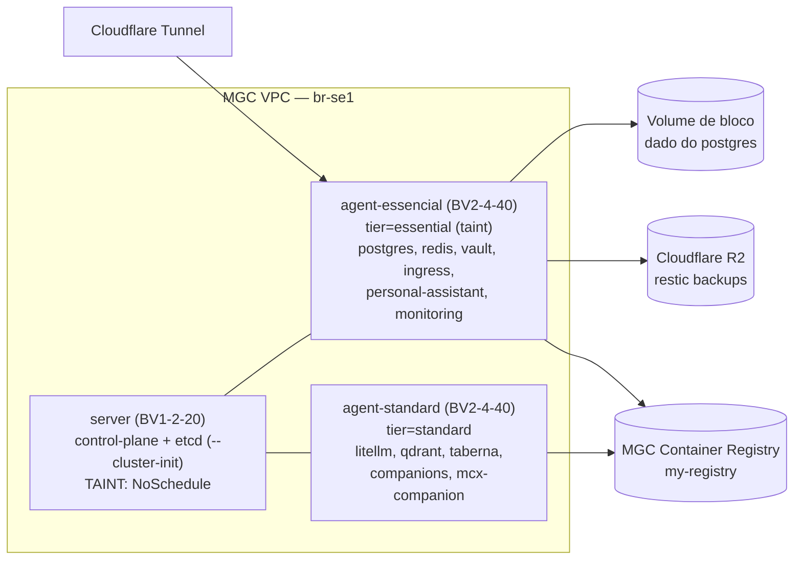
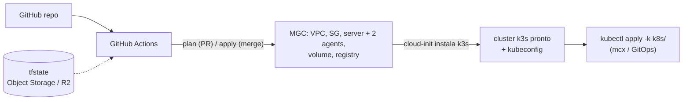

## Sumário

Migrar o cluster `oficina` do VPS único (Contabo) para a **Magalu Cloud (MGC)**, na topologia **1 control-plane isolado + 2 workers segmentados por criticidade**, dentro de ~R$ 300/mês. O desenho prioriza **resiliência custo-efetiva + crescimento empírico** sobre HA prematura: começa no mínimo viável, cresce por observação (Grafana), e mantém o caminho para HA real aberto via `--cluster-init`. Resiliência vem de backup off-cluster testado (restic→R2) + dado em volume de bloco destacável, não de quórum de etcd nem storage replicado — ainda.

Esta RFC consolida todas as decisões de arquitetura, o registro das alternativas descartadas, o plano de migração executável (IaC + dados) e o caminho de evolução.

---

## 1. Contexto (RM-ODP View)

### 🎯 Enterprise View (Negócio & Valor)

- **Objetivo:** sair de um single-node sem redundância para uma plataforma multi-tenant observável, com custo previsível (~R$ 300/mês) e crescimento guiado por dado real.
- **Motivador:** o nó único Contabo é SPOF total. O workload já cresceu além do plano original (litellm, qdrant, personal-assistant, monitoring completo) e precisa de uma base que escale por adição de nós, não por reprovisionamento manual.

### 🏗️ Engineering View (Técnica)

- **Solução:** k3s com **1 `server` (control-plane + etcd, `--cluster-init`, com taint) + 2 `agent`** segmentados por criticidade (`tier=essential` / `tier=standard`), em VMs Balanced Value na MGC `br-se1`.
- **Estratégia:** apps são **stateless** (estado no postgres compartilhado) → reagendáveis. ⚠️ Nesta topologia o benefício de failover é **latente**: com 1 nó por tier + taint, um pod não cai no outro tier — só vira reagendamento automático a partir do 2º nó no tier. O que se ganha *hoje* é blast-radius + dado limpo. Dado stateful em **volume de bloco destacável** (sobrevive a resize/replace). Right-sizing **empírico** via Prometheus/Grafana. Infra em **Terraform** (provider `magalucloud/mgc`) aplicada por GitHub Actions; k3s via cloud-init.

### 💾 Information View (Dados)

- **Escopo:** PVCs/volumes de `shared/postgres`, `shared/redis`, `apps/qdrant`, `apps/vaultwarden` (SQLite — exceção), `apps/personal-assistant`, e o volume do Loki (logs, regenerável).
- **Impacto:** o estado concentra-se no **shared postgres** (apps já o usam via `DATABASE_URL`). **Gap crítico:** as bases de `litellm`/`taberna`/`companions` no postgres **não têm backup**, e o postgres não tem backup de instância. Fechar isso é **pré-requisito bloqueante** da migração.

---

## 2. Análise de Qualidade (ISO-25010)

| Atributo | Meta |
|---|---|
| **Reliability** | App essencial protegido do mau comportamento de app não-essencial (isolamento por nó). Recuperação de dado = restore do R2 / reattach do volume (RTO = tempo de restore; sem failover automático — escolha consciente). |
| **Cost (OPEX)** | Início ~R$ 261/mês, ~R$ 39 de folga. Postgres gerenciado (R$ 94) e Longhorn descartados por custo/footprint. |
| **Performance Efficiency** | Sizing dirigido por dado real (Grafana), não por chute. Nós mínimos viáveis; cresce sob demanda. |
| **Maintainability** | GitOps Kustomize + IaC Terraform. Crescer = `count++` de agents, sem tocar control-plane. Registry externo mata o bootstrap chicken-egg. |
| **Portability** | Backups em R2 (off-MGC) sobrevivem a falha total da MGC. Dado em volume destacável + snapshots MGC. |
| **Security** | Tráfego intra-cluster por VPC/SG; `6443`/`22` restritos ao IP do operador. Secrets via `kubectl`, nunca em Git. Taint isola o control-plane. |

---

## 3. Abordagem Arquitetural

### Topologia inicial



| Nó | Perfil | Custo/mês | Papel |
|---|---|---|---|
| `server` | `BV1-2-20` (1vCPU·2GB·20GB) | R$ 54,99 | Control-plane + etcd (`--cluster-init`). **Taint `NoSchedule`** — sem workload. |
| `agent-essencial` | `BV2-4-40` (2vCPU·4GB·40GB) | R$ 102,99 | Apps com SLO + plataforma. Taint `tier=essential`. |
| `agent-standard` | `BV2-4-40` (2vCPU·4GB·40GB) | R$ 102,99 | Apps sem SLO / experimentação. |
| **Total** | | **R$ 260,97** | ~R$ 39 de folga. + registry (centavos). |

> Esta é a topologia *inicial*. Ela cresce por adição de nós (ver §"Caminho de evolução"). O custo é igual ao de um `1+2` genérico, mas a arquitetura é deliberada: apps stateless, split por criticidade, control-plane isolado.

### Decisões e alternativas descartadas

1. **Control-plane isolado (`server` com taint), não all-in-one.** Workload nunca sufoca a API/etcd; métricas do nó de workload refletem só o workload (dado mais limpo); scale-out por `count++` sem nunca tocar o control-plane.
   - `Single-node all-in-one (4·16·40, R$250)` — descartado: mais RAM útil e mais simples, mas não dá o isolamento de control-plane nem a estrutura multi-node que o crescimento incremental exige; converter depois é reshuffle.

2. **2 workers segmentados por criticidade** (`tier=essential` / `tier=standard`), via taint + toleration + `nodeAffinity`.
   - Isolamento de blast-radius **físico**: app não-essencial em loop/vazamento não derruba os essenciais. Alinha com o tenant `sandbox` (sem SLO).
   - `priorityClasses + limits num nó compartilhado` — alternativa **lógica** mais barata (economiza ~R$ 103/mês); descartada em favor da garantia física, dado o objetivo de operar multi-node de verdade. Permanece como fallback se o orçamento apertar.
   - **Limitação honesta:** o split protege os essenciais do *consumo* dos não-essenciais — **não** da queda do postgres (caminho crítico de quase todos), nem entrega failover enquanto cada tier tiver 1 nó (o taint impede que pods do standard caiam no essential). Failover real vem do 2º nó por tier (reagendamento) + CloudNativePG para o postgres (evolução).

3. **Apps stateless sobre o shared postgres.** A maioria (`litellm`, `taberna`, `companions`, `distill-rss`) **já usa `DATABASE_URL`**. Pods sem estado são reagendáveis — o que prepara o failover automático **quando** um tier ganhar o 2º nó (hoje, com 1 nó/tier, ficam `Pending` até o nó voltar; ver limitação em #2).
   - `vaultwarden em postgres` — **descartado**: é o app mais crítico (cofre), single-user, baixa escrita. SQLite dá domínio de falha isolado + restore standalone trivial (cenário de desastre do RFC-0001). **Mantido em SQLite como exceção justificada**, fixado por `nodeAffinity` ao `agent-essencial`. (Ver [`07-isolamento-no-data-layer-vence-no-app-layer.md`](../concepts/07-isolamento-no-data-layer-vence-no-app-layer.md).)
   - `MGC managed PostgreSQL (R$ 94/mês)` — descartado: 31% do orçamento, instância única sem HA.
   - **Evolução:** `CloudNativePG` (operator) para PITR + failover *self-hosted* — a peça que dará failover real à plataforma inteira, quando valer.

4. **Storage local (`local-path`) + dado stateful em volume de bloco destacável.**
   - O dado do postgres vive num `mgc_block_storage_volumes` anexado ao `agent-essencial` → **sobrevive a resize/replace** do nó; ganha snapshots MGC (PITR local) além do restic→R2 (DR off-site).
   - `Longhorn` — descartado: ~0,5–1 GB RAM/nó + disco de réplicas; fura orçamento/footprint.

5. **Registry externo: MGC Container Registry (`my-registry`, `br-se1`).** Desacopla imagens do ciclo do *cluster* (mata o bootstrap chicken-egg); pull in-region; custo = só storage.
   - `Registry self-hosted` — **aposentado** (vive no cluster, recria o chicken-egg).
   - `GitLab CR / ghcr.io` — plano B (grátis, sobrevive a saída da MGC), mas pull pela internet.

6. **Ingress + gestão.** Ingress de apps via Cloudflare Tunnel (outbound-only). Os nós recebem **IPv4 público** (egress + acesso); kubeconfig aponta para o IP público do `server`, SG restringe `6443`/`22` ao `/32` do operador.
   - `NAT gateway dedicado` — descartado: recurso faturado à parte; IP público por nó já cobre egress.

7. **IaC com Terraform (`magalucloud/mgc`) no GitHub.** `plan` em PR, `apply` em merge com approval. k3s via cloud-init.
   - `Managed Kubernetes` — descartado: custo de control-plane gerenciado remove a alavanca do `server` self-managed de 2 GB.
   - `Provisionamento manual` — descartado: não reproduzível; IaC é pré-requisito de DR.

8. **Começar no mínimo e crescer por dado.** Nós mínimos viáveis; right-sizing via Grafana antes de escalar.
   - `Maximizar RAM de início (16 GB+)` — descartado: chute caro; o loop empírico dá sizing mais assertivo e ainda ensina o consumo real de cada app.

---

## 4. Solução Técnica e Implementação

### Duas camadas: IaC (Terraform) ↔ GitOps (Kustomize)

Fronteira clara: Terraform para no "cluster pronto + kubeconfig"; o que roda *dentro* segue no fluxo Kustomize/`mcx`.



**Layout do repositório (proposto):**

```
infra/
├── main.tf            ← provider mgc + backend s3 (tfstate)
├── network.tf         ← vpc, subnetpool, subnet, security group + rules
├── compute.tf         ← ssh key, server + 2 agents (count), volume + attachment, user_data
├── registry.tf        ← mgc_container_registries (import do my-registry)
├── variables.tf       ← api_key, k3s_token (sensitive), operator_cidr
├── outputs.tf         ← IPs públicos/privados, dica de kubeconfig
└── cloud-init/
    ├── server.sh.tftpl    # k3s server --cluster-init --node-taint ...
    └── agent.sh.tftpl     # k3s agent + --node-label tier=<...>
.github/workflows/terraform.yml   ← plan em PR / apply em merge (com approval)
```

**Provider + backend** (estado tem secrets → bucket privado, fora do Git):

```hcl
terraform {
  required_providers { mgc = { source = "magalucloud/mgc", version = ">~ 0.32.0" } }
  backend "s3" {
    bucket = "oficina-tfstate"
    key    = "cluster/terraform.tfstate"
    region = "br-se1"
    endpoints = { s3 = "https://br-se1.magaluobjects.com/" }
    skip_region_validation = true
    skip_credentials_validation = true
    skip_requesting_account_id  = true
    skip_s3_checksum = true
    use_lockfile = true   # lock nativo (TF ≥1.10) SE o endpoint suportar If-None-Match; senão sem lock (operador solo)
  }
}
provider "mgc" { api_key = var.api_key; region = "br-se1" }
```

**Mapa de recursos:**

| Recurso Terraform | Para quê |
|---|---|
| `mgc_network_vpcs` + `_subnetpools` + `_vpcs_subnets` | Rede privada do cluster |
| `mgc_network_security_groups` + `_rules` | Intra-cluster por CIDR (6443, 8472/udp, 10250, 51820-51821/udp); `6443`+`22` do `/32` do operador; egress liberado |
| `mgc_ssh_keys` | Acesso SSH (restrito por SG) |
| `mgc_virtual_machine_instances` | `server` (`BV1-2-20`) + 2× `agent` (`BV2-4-40`), `availability_zone="br-se1-a"`, `allocate_public_ipv4=true` |
| `mgc_block_storage_volumes` + `_volume_attachment` | Dado stateful (postgres) destacável, no `agent-essencial` |
| `mgc_block_storage_snapshots` | Snapshot PITR local do volume (complementa restic→R2) |
| `mgc_container_registries` | `my-registry` (import) |

**Bootstrap k3s via cloud-init:** `K3S_TOKEN` fixo (var sensível). Server com `--cluster-init` (etcd embarcado, abre a porta da HA) + `--node-taint`. Agents com `--node-label tier=essential|standard` e join via IP privado do server (`.local_ipv4`) → dependência implícita ordena a criação.

```hcl
resource "mgc_virtual_machine_instances" "server" {
  name = "oficina-server"; machine_type = "BV1-2-20"   # validar string exata: mgc vm machine-types list
  image = "cloud-ubuntu-24.04 LTS"; ssh_key_name = mgc_ssh_keys.ops.name
  availability_zone = "br-se1-a"; allocate_public_ipv4 = true
  creation_security_groups = [mgc_network_security_groups.k3s.id]
  user_data = base64encode(templatefile("cloud-init/server.sh.tftpl", { token = var.k3s_token }))
  lifecycle { prevent_destroy = true }   # remover deliberadamente para resize (troca de machine_type força replace)
}

locals { agents = { essential = "BV2-4-40", standard = "BV2-4-40" } }   # crescer = adicionar entradas aqui

resource "mgc_virtual_machine_instances" "agent" {
  for_each = local.agents
  name = "oficina-agent-${each.key}"; machine_type = each.value
  image = "cloud-ubuntu-24.04 LTS"; ssh_key_name = mgc_ssh_keys.ops.name
  availability_zone = "br-se1-a"; allocate_public_ipv4 = true
  creation_security_groups = [mgc_network_security_groups.k3s.id]
  user_data = base64encode(templatefile("cloud-init/agent.sh.tftpl", {
    token = var.k3s_token, server_ip = mgc_virtual_machine_instances.server.local_ipv4, tier = each.key
  }))
}
```

**Pipeline GitHub Actions:** MGC não suporta OIDC federado → `api_key`/`k3s_token` como **secrets do repositório/environment** (`TF_VAR_*`). `plan` em PR (comentário); `apply` só em merge para `main`, atrás de *environment protection* com aprovação manual.

### 🔍 Gaps Identificados

- `shared/postgres`: **sem backup de instância**; bases de `litellm`/`taberna`/`companions` **sem `pg_dump`** dedicado → fora do regime de restore. **Bloqueia a migração.**
- `apps/personal-assistant`: PVC sem backup; **verificar se é banco** (sem `DATABASE_URL` aparente) ou arquivos.
- `infrastructure/registry`: vive no cluster; substituir pelo `my-registry`.
- Manifests sem `nodeAffinity`/taint-toleration por criticidade, sem `imagePullSecret`, sem fixar postgres no volume de bloco.
- `mcx`: `deploy image` usa `port-forward svc/registry`; reapontar para o registry MGC com `docker login`.
- Sem IaC, sem bucket de tfstate, sem secrets de CI.

### 🛠️ Plano de Ação

**Fase 0 — Pré-requisito: fechar o gap de backup (no Contabo atual)**

Inventário explícito de stateful — cada item ou tem backup ou é declarado regenerável:

| Dataset | Tipo | Ação |
|---|---|---|
| `shared/postgres` (todas as bases: litellm, taberna, companions, distill-rss, …) | banco | **Backup `pg_dumpall` → restic → R2** (gap) |
| `apps/vaultwarden` `/data/db.sqlite3` | SQLite | já coberto (CronJob restic) |
| `apps/qdrant` (vetores) | vector store | **Verificar:** re-embeddável da fonte → regenerável; senão **incluir no backup** |
| `apps/personal-assistant` PVC | ? | **Verificar:** banco/arquivos → cobrir; ou regenerável |
| `apps/distill-rss` PVC (digests) | derivado | **Regenerável** (RFC-0001) → fora de escopo |
| `shared/redis` | cache | **Verificar:** se cache puro → regenerável; senão cobrir |
| Loki (logs) | observabilidade | regenerável → fora de escopo |

- [ ] Implementar/confirmar o backup de cada linha "gap"/"verificar" acima.
- [ ] **Smoke test + `restic snapshots`** confirmando cada dataset não-regenerável.

**Fase 1 — IaC: provisionar MGC via Terraform**
- [ ] Bucket de tfstate (MGC Object Storage `oficina-tfstate` ou R2) + secrets no GitHub.
- [ ] Escrever `infra/` + `.github/workflows/terraform.yml`.
- [ ] SG: `6443/tcp`, `8472/udp`, `10250/tcp`, `51820-51821/udp` intra-VPC; `6443`+`22` do `/32` do operador.
- [ ] `cloud-init/server.sh.tftpl`: k3s server `--cluster-init` + `--node-taint CriticalAddonsOnly=true:NoSchedule`.
- [ ] `cloud-init/agent.sh.tftpl`: k3s agent + `--node-label tier=essential|standard`; taint `tier=essential:NoSchedule` no nó essencial.
- [ ] Volume de bloco para o postgres + attachment ao `agent-essencial`.
- [ ] `import` do `my-registry`.
- [ ] `terraform apply` → `kubectl get nodes` (3 Ready) + rede de pods OK.
- [ ] **Tolerations** de promtail/node-exporter para os taints (senão server/essencial sem telemetria).

**Fase 2 — Adaptar manifests (GitOps)**
- [ ] `imagePullSecret` por namespace que puxa imagem custom; reapontar imagens para `my-registry`; remover `infrastructure/registry`.
- [ ] `nodeAffinity`/tolerations por `tier`; fixar postgres (`agent-essencial`) com dado no volume de bloco; vaultwarden (SQLite) fixado no `agent-essencial`.
- [ ] (Opcional) `replicas: 2` + anti-affinity só no ingress (traefik/cloudflared) quando houver ≥2 nós que os tolerem.
- [ ] Atualizar `mcx.toml` (host, push para registry MGC) e labels de tenant.

**Fase 3 — Cutover de dados**
- [ ] `kubectl apply -k k8s/` (sobe sem dados).
- [ ] Restore de cada dataset do R2 (postgres via dump; vaultwarden via `restic restore`). **Pod de restore no nó onde a app está fixada** (`local-path` cria o PV ali).
- [ ] Validar dados, conectividade, ingress; repontar o Cloudflare Tunnel.

**Fase 4 — Descomissionar Contabo**
- [ ] **Só após** validação completa + restore confirmado de *todos* os datasets. Janela de double-spend (esperada) antes de desligar.

### Capacidade por nó (mínimo viável) + loop empírico

`requests` por nó (Jobs/CronJobs intermitentes não contam). Rascunho do corte — **a classificação final é do operador**:

| `agent-essencial` (`BV2-4-40`, ~3,3 GB alocáveis) | req | `agent-standard` (`BV2-4-40`) | req |
|---|---|---|---|
| monitoring (prom 256 + loki 128 + grafana 128 + DS/operador) | ~950Mi | litellm | 512Mi |
| postgres (+exporter) | 288Mi | mcx-companion | 512Mi |
| personal-assistant | 256Mi | qdrant | 256Mi |
| traefik + cloudflared | 192Mi | taberna | 128Mi |
| redis (+exporter) | 80Mi | companions | 128Mi |
| vaultwarden | 64Mi | app-exemplo | 32Mi |
| **+ overhead ~0,5 GB** | **~2,33 GB** | **+ overhead ~0,5 GB** | **~2,07 GB** |

Ambos ≤ ~2,3 GB contra ~3,3 GB alocáveis → **~70%, cabe com folga para observar.** ✅

**Loop empírico (é como o sizing fica assertivo):**
1. Sobe no mínimo; tudo rodando.
2. Grafana mostra uso *real* vs `requests/limits` dos manifests (muitos inflados).
3. Right-size os manifests para baixo com base no dado.
4. Escala o nó / adiciona agent só quando o uso real encostar no teto.

> ⚠️ **Watch-items de OOM:** (a) `litellm` (limit 1,5 GB) + `mcx-companion` (limit 1 GB) no `agent-standard` de 4 GB em pico simultâneo — mas é o nó "descartável" (blast-radius por design); reclassificar/subir para `BV2-8-40` (→ total R$ 297,97) se preciso. (b) **`Prometheus` no `agent-essencial`**: 512Mi de limit contra 15d de retenção scraping ~10 alvos costuma ser apertado — é o nó com menos folga. O loop empírico pega ambos; subir o limit do Prometheus ou reduzir retenção conforme o Grafana mostrar.

---

## 5. Caminho de Evolução

O desenho é deliberadamente um **ponto de partida que cresce sem reshuffle**:

1. **+ Capacidade** → adicionar entrada em `local.agents` (Terraform `for_each`); novo `k3s agent` sobe via cloud-init; pods stateless espalham sozinhos. **Nunca toca o control-plane nem os nós existentes.** (2º agent de 4 GB cabe a R$ 298 após right-sizing; além disso = decisão de subir o teto.)
2. **+ Disco** → `size` do volume de bloco cresce (nunca diminui), sem recriar.
3. **HA do data layer** → `CloudNativePG` (primary + replica + PITR) — a peça que dá failover real à plataforma.
4. **HA do control-plane** → como o server nasceu com `--cluster-init` (etcd), promover = adicionar 2 servers (`--server`), virando quórum de 3. **Sem migração de datastore** (o motivo de usar `--cluster-init` desde o dia 1).

---

## 6. Riscos e Mitigações

| Risco | Prob. | Impacto | Mitigação |
|---|---|---|---|
| **Perda de dado na migração** (postgres/personal-assistant sem backup hoje) | Média | **Alto** | Fase 0 bloqueante; não descomissionar Contabo sem restore verificado. |
| **Queda do `agent-essencial`** (postgres + plataforma) | Baixa | **Alto** | Dado no volume de bloco sobrevive; reattach/restore. RTO = restore. Evolução: CloudNativePG. |
| **Queda do `agent-standard`** | Baixa | Baixo | Apps sem SLO; reagendam quando o nó volta. Essenciais intactos (isolamento). |
| **Queda do `server`** (control-plane) | Baixa | Médio | Apps seguem rodando; só a API cai. `--cluster-init` permite promover a HA. |
| **Single-AZ `br-se1`** | Muito baixa | **Alto** | DR = reprovisionar (`terraform apply`) + restore do R2 (off-MGC). |
| **OOM no `agent-standard`** (litellm/mcx) | Média | Baixo | Por design no nó descartável; reclassificar/subir nó se necessário. |
| **Secrets no tfstate** (plaintext) | Alta | Médio | Bucket privado; creds só em secrets do GitHub; nunca commitar `*.tfvars`. |
| **`apply` destrutivo** (recriar VM = perder dado local) | Baixa | **Alto** | Approval manual + revisar `plan`. Dado do **postgres** sobrevive (volume destacável). **vaultwarden** (SQLite em `local-path`, *não* no volume) = restore do R2 no replace. `prevent_destroy` no `server`; considerar também no `agent-essencial`. *Nota:* `prevent_destroy` bloqueia resize de `machine_type` (force replace) — remover deliberadamente para resize. |
| **Resize de VM in-place vs replace** (não confirmado na MGC) | Média | Médio | Dado no volume destacável de-risca; **validar comportamento** antes do 1º resize. |

---

## 7. Métricas de Sucesso

- [ ] `terraform apply` cria o ambiente do zero, reproduzível; `plan` limpo (sem drift) após cutover.
- [ ] `kubectl get nodes` → 3 nós `Ready`; pods por `tier` corretos (taint/toleration funcionando).
- [ ] `restic snapshots` confirma backup de cada dataset **não-regenerável** do inventário da Fase 0 antes do cutover.
- [ ] App não-essencial em OOM no `agent-standard` **não** afeta apps no `agent-essencial` (isolamento provado).
- [ ] Custo mensal real ≤ R$ 270 (cluster + registry), confirmado na fatura MGC.
- [ ] Após 2–3 semanas: `requests` dos manifests ajustados ao uso real observado no Grafana.
- [ ] Contabo desligado somente após todos os itens acima ✅.

---

## Apêndice — Itens a confirmar antes do `apply`

1. String exata de `machine_type` (`mgc vm machine-types list`) — `BV1-2-20`/`BV2-4-40` inferidos da tabela de preços.
2. Custo de IPv4 público reservado vs. a folga de ~R$ 39 (geralmente grátis enquanto anexado).
3. Suporte a `use_lockfile` no endpoint `magaluobjects.com`.
4. Comportamento de resize de `machine_type` (in-place vs replace).
5. Corte final essencial/não-essencial (rascunho na §4) — decisão do operador; `distill-rss` e `litellm` são os limítrofes.
