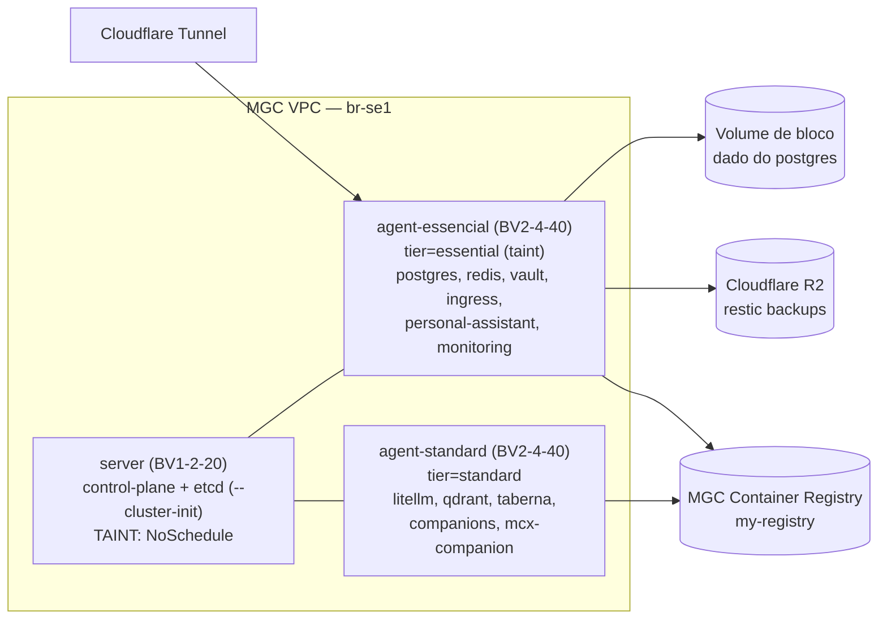
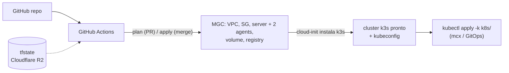

> **Status de implementação (2026-05-30 — atualizado após revisão de riscos):** Cluster MGC provisionado e operacional. Fase 1 concluída: 3 nós `Ready`, taints/labels aplicados, volume de bloco anexado ao `agent-essential`. Fase 2 (adaptar manifests GitOps) em andamento. Contabo ainda ativo (double-spend intencional durante validação).
>
> **Decisões tomadas em 2026-05-30:**
> - **Qdrant:** PVC (`qdrant-storage`, 5Gi, `local-path` no `agent-standard`) em vez de `emptyDir` — vetores persistem entre restarts do pod. Replace do `agent-standard` (sem `prevent_destroy`) requer restore manual dos vetores; aceito como trade-off do nó descartável.
> - **Redis:** confirmado cache puro → regenerável → fora do inventário de backup da Fase 0.
> - **Rejoin de agents:** playbook `ansible/playbooks/k3s-agents-rejoin.yml` criado para automatizar o join após replace/reprovisionamento de VM (endereça o risco de rejoin manual sem documentação).
>
> **⚠️ Incidente 2026-05-30 — apply acidental no Contabo:**
> `kubectl apply -k k8s/` foi executado contra o Contabo (kubeconfig padrão `173.249.55.64`) em vez do MGC. Os manifests com `nodeAffinity` para `tier=essential/standard` criaram pods `Pending` em 9 deployments. Pods antigos continuam `Running` — tráfego não foi cortado. **Ação pendente do operador:**
> ```bash
> # Rollback no Contabo para limpar pods Pending
> kubectl rollout undo deployment/cantinho -n cantinho
> kubectl rollout undo deployment/distill-rss -n distill-rss
> kubectl rollout undo deployment/litellm -n litellm
> kubectl rollout undo deployment/personal-assistant -n personal-assistant
> kubectl rollout undo deployment/registry -n registry
> kubectl rollout undo deployment/postgres -n shared
> kubectl rollout undo deployment/redis -n shared
> kubectl rollout undo deployment/taberna -n taberna
> kubectl rollout undo deployment/vaultwarden -n vaultwarden
> ```
> Após rollback, configurar kubeconfig do MGC e executar o deploy lá (ver Runbook de Deploy MGC abaixo).

## Sumário

Migrar o cluster `oficina` do VPS único (Contabo) para a **Magalu Cloud (MGC)**, na topologia **1 control-plane isolado + 2 workers segmentados por criticidade**, dentro de ~R$ 300/mês. O desenho prioriza **resiliência custo-efetiva + crescimento empírico** sobre HA prematura: começa no mínimo viável, cresce por observação (Grafana), e mantém o caminho para HA real aberto via `--cluster-init`. Resiliência vem de backup off-cluster testado (restic→R2) + dado em volume de bloco destacável, não de quórum de etcd nem storage replicado — ainda.

Esta RFC consolida todas as decisões de arquitetura, o registro das alternativas descartadas, o plano de migração executável (IaC + dados) e o caminho de evolução.

---

## 1. Contexto (RM-ODP View)

### 🎯 Enterprise View (Negócio & Valor)

- **Objetivo:** sair de um single-node sem redundância para uma plataforma multi-tenant observável, com custo previsível (~R$ 300/mês) e crescimento guiado por dado real.
- **Motivador:** o nó único Contabo é SPOF total. O workload já cresceu além do plano original (litellm, qdrant, personal-assistant, monitoring completo) e precisa de uma base que escale por adição de nós, não por reprovisionamento manual.

### 🏗️ Engineering View (Técnica)

- **Solução:** k3s com **1 `server` (control-plane + etcd, `--cluster-init`, com taint) + 2 `agent`** segmentados por criticidade (`tier=essential` / `tier=standard`), em VMs Balanced Value na MGC `br-se1`.
- **Estratégia:** apps são **stateless** (estado no postgres compartilhado) → reagendáveis. ⚠️ Nesta topologia o benefício de failover é **latente**: com 1 nó por tier + taint, um pod não cai no outro tier — só vira reagendamento automático a partir do 2º nó no tier. O que se ganha *hoje* é blast-radius + dado limpo. Dado stateful em **volume de bloco destacável** (sobrevive a resize/replace). Right-sizing **empírico** via Prometheus/Grafana. Infra em **Terraform** (provider `magalucloud/mgc`) aplicada por GitHub Actions; k3s via cloud-init.

### 💾 Information View (Dados)

- **Escopo:** PVCs/volumes de `shared/postgres`, `shared/redis`, `apps/qdrant`, `apps/vaultwarden` (SQLite — exceção), `apps/personal-assistant`, e o volume do Loki (logs, regenerável).
- **Impacto:** o estado concentra-se no **shared postgres** (apps já o usam via `DATABASE_URL`). **Gap crítico:** as bases de `litellm`/`taberna`/`companions` no postgres **não têm backup**, e o postgres não tem backup de instância. Fechar isso é **pré-requisito bloqueante** da migração.

---

## 2. Análise de Qualidade (ISO-25010)

| Atributo | Meta |
|---|---|
| **Reliability** | App essencial protegido do mau comportamento de app não-essencial (isolamento por nó). Recuperação de dado = restore do R2 / reattach do volume (RTO = tempo de restore; sem failover automático — escolha consciente). |
| **Cost (OPEX)** | Início ~R$ 261/mês, ~R$ 39 de folga. Postgres gerenciado (R$ 94) e Longhorn descartados por custo/footprint. |
| **Performance Efficiency** | Sizing dirigido por dado real (Grafana), não por chute. Nós mínimos viáveis; cresce sob demanda. |
| **Maintainability** | GitOps Kustomize + IaC Terraform. Crescer = `count++` de agents, sem tocar control-plane. Registry externo mata o bootstrap chicken-egg. |
| **Portability** | Backups em R2 (off-MGC) sobrevivem a falha total da MGC. Dado em volume destacável + snapshots MGC. |
| **Security** | Tráfego intra-cluster por VPC/SG; `6443`/`22` restritos ao IP do operador. Secrets via `kubectl`, nunca em Git. Taint isola o control-plane. |

---

## 3. Abordagem Arquitetural

### Topologia inicial



| Nó | Perfil | Custo/mês | Papel |
|---|---|---|---|
| `server` | `BV1-2-20` (1vCPU·2GB·20GB) | R$ 54,99 | Control-plane + etcd (`--cluster-init`). **Taint `NoSchedule`** — sem workload. |
| `agent-essencial` | `BV2-4-40` (2vCPU·4GB·40GB) | R$ 102,99 | Apps com SLO + plataforma. Taint `tier=essential`. |
| `agent-standard` | `BV2-4-40` (2vCPU·4GB·40GB) | R$ 102,99 | Apps sem SLO / experimentação. |
| **Total** | | **R$ 260,97** | ~R$ 39 de folga. + registry (centavos). |

> Esta é a topologia *inicial*. Ela cresce por adição de nós (ver §"Caminho de evolução"). O custo é igual ao de um `1+2` genérico, mas a arquitetura é deliberada: apps stateless, split por criticidade, control-plane isolado.

### Decisões e alternativas descartadas

1. **Control-plane isolado (`server` com taint), não all-in-one.** Workload nunca sufoca a API/etcd; métricas do nó de workload refletem só o workload (dado mais limpo); scale-out por `count++` sem nunca tocar o control-plane.
   - `Single-node all-in-one (4·16·40, R$250)` — descartado: mais RAM útil e mais simples, mas não dá o isolamento de control-plane nem a estrutura multi-node que o crescimento incremental exige; converter depois é reshuffle.

2. **2 workers segmentados por criticidade** (`tier=essential` / `tier=standard`), via taint + toleration + `nodeAffinity`.
   - Isolamento de blast-radius **físico**: app não-essencial em loop/vazamento não derruba os essenciais. Alinha com o tenant `sandbox` (sem SLO).
   - `priorityClasses + limits num nó compartilhado` — alternativa **lógica** mais barata (economiza ~R$ 103/mês); descartada em favor da garantia física, dado o objetivo de operar multi-node de verdade. Permanece como fallback se o orçamento apertar.
   - **Limitação honesta:** o split protege os essenciais do *consumo* dos não-essenciais — **não** da queda do postgres (caminho crítico de quase todos), nem entrega failover enquanto cada tier tiver 1 nó (o taint impede que pods do standard caiam no essential). Failover real vem do 2º nó por tier (reagendamento) + CloudNativePG para o postgres (evolução).

3. **Apps stateless sobre o shared postgres.** A maioria (`litellm`, `taberna`, `companions`, `distill-rss`) **já usa `DATABASE_URL`**. Pods sem estado são reagendáveis — o que prepara o failover automático **quando** um tier ganhar o 2º nó (hoje, com 1 nó/tier, ficam `Pending` até o nó voltar; ver limitação em #2).
   - `vaultwarden em postgres` — **descartado**: é o app mais crítico (cofre), single-user, baixa escrita. SQLite dá domínio de falha isolado + restore standalone trivial (cenário de desastre do RFC-0001). **Mantido em SQLite como exceção justificada**, fixado por `nodeAffinity` ao `agent-essencial`. (Ver [`07-isolamento-no-data-layer-vence-no-app-layer.md`](../concepts/07-isolamento-no-data-layer-vence-no-app-layer.md).)
   - `MGC managed PostgreSQL (R$ 94/mês)` — descartado: 31% do orçamento, instância única sem HA.
   - **Evolução:** `CloudNativePG` (operator) para PITR + failover *self-hosted* — a peça que dará failover real à plataforma inteira, quando valer.

4. **Storage local (`local-path`) + dado stateful em volume de bloco destacável.**
   - O dado do postgres vive num `mgc_block_storage_volumes` anexado ao `agent-essencial` → **sobrevive a resize/replace** do nó; ganha snapshots MGC (PITR local) além do restic→R2 (DR off-site).
   - `Longhorn` — descartado: ~0,5–1 GB RAM/nó + disco de réplicas; fura orçamento/footprint.

5. **Registry externo: MGC Container Registry (`my-registry`, `br-se1`).** Desacopla imagens do ciclo do *cluster* (mata o bootstrap chicken-egg); pull in-region; custo = só storage.
   - `Registry self-hosted` — **aposentado** (vive no cluster, recria o chicken-egg).
   - `GitLab CR / ghcr.io` — plano B (grátis, sobrevive a saída da MGC), mas pull pela internet.

6. **Ingress + gestão.** Ingress de apps via Cloudflare Tunnel (outbound-only). Os nós recebem **IPv4 público** (egress + acesso); kubeconfig aponta para o IP público do `server`, SG restringe `6443`/`22` ao `/32` do operador.
   - `NAT gateway dedicado` — descartado: recurso faturado à parte; IP público por nó já cobre egress.

7. **IaC com Terraform (`magalucloud/mgc`) no GitHub.** `plan` em PR, `apply` em merge com approval. k3s via cloud-init.
   - `Managed Kubernetes` — descartado: custo de control-plane gerenciado remove a alavanca do `server` self-managed de 2 GB.
   - `Provisionamento manual` — descartado: não reproduzível; IaC é pré-requisito de DR.

8. **Começar no mínimo e crescer por dado.** Nós mínimos viáveis; right-sizing via Grafana antes de escalar.
   - `Maximizar RAM de início (16 GB+)` — descartado: chute caro; o loop empírico dá sizing mais assertivo e ainda ensina o consumo real de cada app.

---

## 4. Solução Técnica e Implementação

### Duas camadas: IaC (Terraform) ↔ GitOps (Kustomize)

Fronteira clara: Terraform para no "cluster pronto + kubeconfig"; o que roda *dentro* segue no fluxo Kustomize/`mcx`.



**Layout implementado** (`terraform/`, validado com `terraform plan`):

```
terraform/
├── main.tf            ← provider mgc + backend s3 vazio (configurado via backend.hcl)
├── network.tf         ← vpc, subnetpool, subnet, security group + rules
├── compute.tf         ← ssh key, server, agent_essential, agent_standard (recursos separados)
├── storage.tf         ← volume de bloco (postgres) + attachment ao agent_essential
├── registry.tf        ← mgc_container_registries (import do my-registry)
├── variables.tf       ← mgc_api_key, k3s_token (sensitive), operator_cidr, ssh_public_key
├── outputs.tf         ← IPs públicos/privados, registry_id, kubeconfig_hint
├── backend.hcl        ← credenciais do backend R2 (no .gitignore, nunca commitar)
├── backend.hcl.example ← template vazio para referência
├── terraform.tfvars   ← valores das variáveis (no .gitignore, nunca commitar)
├── terraform.tfvars.example ← template vazio para referência
└── cloud-init/
    ├── server.sh.tftpl    # k3s server --cluster-init --node-taint ...
    └── agent.sh.tftpl     # k3s agent + --node-label tier=<...>
.github/workflows/terraform.yml   ← plan em PR / apply em merge (com approval) — pendente
```

**Provider + backend** (implementado — estado tem secrets → R2 privado, fora do Git):

```hcl
terraform {
  required_version = ">= 1.10"
  required_providers {
    mgc = { source = "magalucloud/mgc", version = "~> 0.51" }  # versão real: 0.51.0
  }
  backend "s3" {}  # configurado via: terraform init -backend-config=backend.hcl
}
provider "mgc" { api_key = var.mgc_api_key; region = "br-se1" }
```

O backend S3 aponta para **Cloudflare R2** (não MGC Object Storage). O `r2_account_id` faz parte apenas do `backend.hcl` (URL do endpoint) — não é uma variável Terraform.

**Mapa de recursos** (17 recursos, `terraform plan` sem erros):

| Recurso Terraform | Para quê |
|---|---|
| `mgc_network_vpcs` + `_subnetpools` + `_vpcs_subnets` | Rede privada do cluster |
| `mgc_network_security_groups` + `mgc_network_security_groups_rules` (5 regras) | Intra-cluster por CIDR (8472/udp, 10250, 51820-51821/udp); `6443`+`22` do `/32` do operador; egress liberado |
| `mgc_ssh_keys` | Acesso SSH (atributo `key`, não `public_key`) |
| `mgc_virtual_machine_instances.server` | `BV1-2-20`, `prevent_destroy=true` |
| `mgc_virtual_machine_instances.agent_essential` | `BV2-4-40`, `prevent_destroy=true` (tem volume anexado) |
| `mgc_virtual_machine_instances.agent_standard` | `BV2-4-40`, sem `prevent_destroy` (nó descartável por design) |
| `mgc_block_storage_volumes.postgres` + `_volume_attachment` | Volume NVMe 40 GB, `prevent_destroy=true`, anexado ao `agent_essential` |
| `mgc_container_registries.main` | `my-registry` (import), `prevent_destroy=true` |

**Bootstrap k3s via cloud-init** (implementado):

- Token escrito em arquivo temporário com `install -m 600` → variável de ambiente `K3S_TOKEN_FILE` passada ao instalador. Nenhum token aparece em `ps` ou `/proc`.
- Server: `--cluster-init`, `--node-taint CriticalAddonsOnly=true:NoSchedule`, `--disable traefik`, `--disable servicelb`. Kubeconfig copiado para `/home/ubuntu/.kube/config` com permissão `600` (sem `--write-kubeconfig-mode 644`).
- Agent: aguarda `https://<server_ip>:6443/healthz` responder antes de tentar o join (evita race condition). Tier `essential` recebe tanto o label quanto o taint via `EXTRA_ARGS`; tier `standard` recebe apenas o label.

**Pipeline GitHub Actions:** pendente de implementação. MGC não suporta OIDC federado → `mgc_api_key`/`k3s_token` como **secrets do repositório/environment** (`TF_VAR_*`). `plan` em PR (comentário); `apply` só em merge para `main`, atrás de *environment protection* com aprovação manual.

### Decisões de implementação que divergiram da RFC original

**[D1] `for_each` substituído por dois recursos separados (`agent_essential` / `agent_standard`)**

A RFC propunha `resource "mgc_virtual_machine_instances" "agent" { for_each = local.agents }` com `prevent_destroy` dentro do `lifecycle`. O Terraform rejeita `prevent_destroy = true` em recursos gerenciados por `for_each` quando o valor do `lifecycle` não pode ser determinado estaticamente — o bloco `lifecycle` não aceita expressões dinâmicas. A solução foi dois recursos explícitos: `agent_essential` (com `prevent_destroy = true`, pois tem o volume de bloco anexado) e `agent_standard` (sem `prevent_destroy`, nó descartável por design). O mapa `local.agents` da RFC foi removido. A nota de evolução na §5 ("adicionar entrada em `local.agents`") deve ser lida como "adicionar um novo recurso `mgc_virtual_machine_instances`".

**[D2] `r2_account_id` removido das variáveis Terraform**

A RFC e o `terraform.tfvars.example` listavam `r2_account_id` como variável Terraform. Na implementação, essa informação é necessária apenas para montar a URL do endpoint no `backend.hcl` (`https://<account_id>.r2.cloudflarestorage.com`). Como o backend é configurado fora do código HCL (via `-backend-config`), não há variável Terraform correspondente. O `variables.tf` definitivo tem apenas `mgc_api_key`, `k3s_token`, `operator_cidr` e `ssh_public_key`.

**[D3] `cloud-init` usa `K3S_TOKEN_FILE` em vez de `export K3S_TOKEN`**

A RFC descrevia o token como variável de ambiente direta. Na implementação, o token é gravado num arquivo temporário com permissão `600` e consumido via `K3S_TOKEN_FILE`. O arquivo é removido após a instalação. Isso impede que o token apareça em `ps aux` ou em `/proc/<pid>/environ` durante o boot.

**[D4] `--write-kubeconfig-mode 644` removido; kubeconfig copiado com `600`**

A abordagem de expor o kubeconfig com `644` (legível por qualquer usuário do sistema) foi descartada. O `server.sh.tftpl` usa `install -m 600 -o ubuntu /etc/rancher/k3s/k3s.yaml /home/ubuntu/.kube/config`, garantindo acesso restrito ao usuário `ubuntu`. O kubeconfig permanece em `/etc/rancher/k3s/k3s.yaml` como `root`-only; a cópia para o operador é feita via `sudo cat` por SSH (dica no output `kubeconfig_hint`).

**[D5] `prevent_destroy` adicionado em `mgc_block_storage_volumes` e `mgc_container_registries`**

A RFC mencionava `prevent_destroy` apenas no `server` e sugeria "considerar também no `agent-essencial`". Na implementação todos os recursos com dado ou estado irreversível têm o lifecycle explícito: `server`, `agent_essential`, `mgc_block_storage_volumes.postgres` e `mgc_container_registries.main`. O `agent_standard` permanece sem `prevent_destroy` (nó descartável).

**[D6] Provider `magalucloud/mgc` versão real: `0.51.0`**

A RFC usava `version = ">~ 0.32.0"` como placeholder. A versão efetivamente instalada e travada no `.terraform.lock.hcl` é `0.51.0`. O constraint no `main.tf` é `~> 0.51`.

**[D7] `mgc_ssh_keys` usa atributo `key` (não `public_key`)**

A documentação consultada durante o planejamento sugeria o atributo `public_key`. O provider `0.51.0` usa `key` para o conteúdo da chave pública. O `variables.tf` declara `ssh_public_key` (nome da variável) que é atribuído ao campo `key` do recurso `mgc_ssh_keys.ops`.

**[D8] Nome correto do recurso de regras de SG: `mgc_network_security_groups_rules`**

A RFC e o mapa de recursos usavam `mgc_network_security_group_rules` (singular). O tipo correto no provider MGC é `mgc_network_security_groups_rules` (plural). Todos os recursos de regra no `network.tf` usam o nome correto.

**[D9] `mgc_container_registries` não expõe atributo `endpoint`**

O output `registry_id` retorna o `.id` do recurso. O endpoint do registry não é um atributo exportado pelo provider — a URL de acesso segue a convenção `<name>.mgc.cr.magalu.com.br` (documentada no próprio output via `description`). A RFC que mencionava usar `.endpoint` diretamente foi ajustada.

**[D10] Health check do control-plane via `nc -z` em vez de `curl /healthz`**

O `cloud-init/agent.sh.tftpl` planejava `curl https://<server_ip>:6443/healthz` para aguardar o control-plane antes do join. O k3s v1.35 passou a exigir autenticação no endpoint `/healthz` — a requisição sem token retorna `401`, fazendo o `until` nunca sair do loop. Solução implementada: `nc -z -w5 <server_ip> 6443` (verifica conectividade TCP na porta sem depender de resposta HTTP autenticada).

**[D11] Join dos agents via Ansible, não pelo cloud-init**

O cloud-init dos agents usava `K3S_TOKEN_FILE` apontando para o token de *seed* (`k3s_token` do `terraform.tfvars`). O k3s gera em runtime um *node-token* completo em `/var/lib/rancher/k3s/server/node-token`, com formato diferente do seed. Os agents tentaram o join com o seed e falharam com autenticação inválida. Solução: playbook Ansible (`ansible/playbooks/k3s-agents.yml`) executa o join *após* o server estar operacional, recebendo o node-token real via `-e k3s_token=<token>`. O inventário (`ansible/inventory.ini`) tem os 2 agents com `k3s_tier` e `k3s_taint` por host; o `group_vars/k3s_cluster.yml` centraliza `k3s_server_ip`/`k3s_server_url`. O cloud-init dos agents permanece no repo mas é redundante — o Ansible é o artefato de provisionamento efetivo dos workers.

**[D12] Porta 22 acessível apenas via SG padrão MGC — workaround via `mgc_network_security_groups_attach`**

O SG customizado (`network.tf`) tem regra de ingress na porta `22/tcp` restrita ao `/32` do operador. A API MGC retornou `403` ao tentar criar essa regra via Terraform — comportamento não documentado do provider `0.51.0`. Workaround: `sg_attach.tf` anexa o **SG padrão MGC** (que já inclui SSH e ICMP) nas interfaces de rede das 3 VMs via `mgc_network_security_groups_attach`, com os `interface_id` hardcoded descobertos via CLI MGC. Consequência: SSH fica acessível de qualquer origem enquanto o SG padrão estiver anexado — **mitigação**: chave SSH como único fator de autenticação; `/32` do operador é o controle de acesso real no nível da chave, não do SG. Item a revisar quando o provider corrigir o bug ou quando houver suporte a Bastion.

**[D13] Rejoin automático de agents pós-replace: playbook dedicado**

O playbook `k3s-agents.yml` instala o k3s pela primeira vez, mas não cobre o caso de replace de VM (onde o agent já foi provisionado e o estado antigo do k3s precisa ser limpo antes do rejoin). Adicionado `ansible/playbooks/k3s-agents-rejoin.yml` que: para o `k3s-agent`, remove o estado antigo (`/var/lib/rancher/k3s/agent`), reinstala com o novo node-token, e aguarda ativação. Uso após replace de VM:
```bash
# Obter node-token atual do server
ssh ubuntu@172.18.1.69 "sudo cat /var/lib/rancher/k3s/server/node-token"
# Reexecutar o join
ansible-playbook -i ansible/inventory.ini ansible/playbooks/k3s-agents-rejoin.yml \
  -e k3s_token=<node-token> [--limit oficina-agent-essential]
```

### 🔍 Gaps Identificados — Fase 2

#### G1 — imagePullSecret: quem precisa e qual registry

Apps que usam `registry.registry.svc.cluster.local:5000/<app>:latest` (registry interno, a remover) devem migrar para `container-registry.br-se1.magalu.cloud/my-registry/<app>:latest` e passar a exigir `imagePullSecrets` apontando para um Secret do tipo `kubernetes.io/dockerconfigjson` em cada namespace.

| App / recurso | Imagem atual (registry interno) | Migra para MGC registry? | Precisa de imagePullSecret? |
|---|---|---|---|
| `companions` (Deployment + migration-job) | `registry.registry.svc.cluster.local:5000/companions:latest` | Sim | Sim |
| `distill-rss` (Deployment + 3 CronJobs + 2 Jobs) | `registry.registry.svc.cluster.local:5000/distill-rss:latest` | Sim | Sim |
| `mcx-companion` (Deployment + CronJob) | `registry.registry.svc.cluster.local:5000/mcx-companion:latest` | Sim | Sim |
| `personal-assistant` (Deployment) | `registry.registry.svc.cluster.local:5000/personal-assistant:latest` | Sim | Sim |
| `taberna` (Deployment + migration-job) | `registry.registry.svc.cluster.local:5000/taberna:latest` | Sim | Sim |
| `vaultwarden` | `vaultwarden/server:latest` (Docker Hub) | Não | Não |
| `litellm` | `ghcr.io/berriai/litellm-database:main-latest` (ghcr.io) | Não | Não |
| `qdrant` | `qdrant/qdrant:latest` (Docker Hub) | Não | Não |
| `postgres` / `redis` / exporters | imagens públicas | Não | Não |
| `traefik` / `cloudflared` | imagens públicas | Não | Não |

Namespaces afetados: `companions`, `distill-rss`, `mcx-companion`, `personal-assistant`, `taberna`. O Secret de pull deve ser criado em cada namespace (não há namespace compartilhado com acesso cross-namespace para imagePullSecrets). Padrão:

```bash
kubectl create secret docker-registry mgc-registry \
  --docker-server=container-registry.br-se1.magalu.cloud/my-registry \
  --docker-username=<mgc-user> \
  --docker-password=<mgc-token> \
  --namespace <app-namespace>
```

Cada Deployment/Job deve incluir `imagePullSecrets: [{name: mgc-registry}]`.

#### G2 — Registry interno (`infrastructure/registry`): quando e como remover

O `infrastructure/registry` (Deployment `registry:2` no namespace `registry`, com PVC) é o registry chicken-egg que serviu o cluster Contabo. No novo cluster ele é obsoleto desde o design — `container-registry.br-se1.magalu.cloud/my-registry` é o substituto.

**Sequência segura de remoção:**

1. Antes do cutover: fazer push de todas as imagens custom para o MGC registry (`mcx deploy image <app>` apontando para o novo registry — requer atualizar `mcx.toml`).
2. Atualizar todos os manifests listados em G1 (imagem + imagePullSecret).
3. Validar que nenhum pod sobe com imagem do registry interno (`kubectl get pods -A -o jsonpath='{..image}' | tr ' ' '\n' | grep registry.registry`).
4. Remover `infrastructure/registry/` do filesystem e de `k8s/infrastructure/kustomization.yaml`.
5. Deletar o namespace no cluster: `kubectl delete namespace registry`.

**Não remover antes** de confirmar pull bem-sucedido de todos os pods com a nova imagem no novo cluster.

#### G3 — Postgres: nodeAffinity + volume de bloco

O `shared/postgres/deployment.yaml` não tem `nodeAffinity` nem `tolerations` para `tier=essential:NoSchedule`. Sem isso, o scheduler não consegue colocar o pod no `agent-essential` (taint bloqueia pods sem toleration), e o `local-path` provisioner cria o PV no nó onde o pod aterrissar — se for o nó errado, os dados ficam no disco local do `agent-standard`.

**Dois problemas independentes:**

1. **Scheduling:** adicionar `nodeAffinity` (`tier=essential`) + `toleration` (`tier=essential:NoSchedule`) ao pod spec.
2. **Volume de bloco:** o PVC atual (`postgres-data`, 5Gi, `local-path`) **não está no volume de bloco MGC**. O volume de bloco foi anexado ao nó via Terraform (`/dev/sdb` ou similar), mas o k3s não monta automaticamente um PVC nele. É preciso:
   - Formatar e montar o dispositivo de bloco em `/mnt/postgres-data` no `agent-essential` (via Ansible ou cloud-init de dia-0).
   - Configurar o `local-path` para usar esse diretório, **ou** criar um `PersistentVolume` estático apontando para `/mnt/postgres-data` com `storageClassName: ""` e `claimRef` para o `postgres-data` PVC.
   - A segunda abordagem (PV estático) é mais explícita e não exige reconfigurar o `local-path` provisioner globalmente.

**Nota:** `shared/postgres/pvc.yaml` pede `5Gi`; o volume de bloco tem `40Gi`. O PV estático deve declarar `40Gi` (ou o tamanho real), e o PVC pode pedir qualquer valor ≤ ao PV. Recomenda-se alinhar para `40Gi` ou criar uma `StorageClass` dedicada.

#### G4 — Vaultwarden: nodeAffinity + continuidade do SQLite

`apps/vaultwarden/deployment.yaml` não tem `nodeAffinity`. O SQLite vive num PVC `local-path` — se o pod cair no `agent-standard` o dado fica lá e sobreviver a um replace do `agent-essential` (que não tem `prevent_destroy`). Fixar no `agent-essential` via `nodeAffinity` + `toleration`.

**Já resolvido:** o arquivo foi atualizado externamente com `nodeAffinity` e `toleration` para `tier=essential` (modificação detectada durante a leitura). Confirmar antes do deploy.

#### G5 — nodeAffinity/tolerations nos demais apps

Apps que não têm `nodeAffinity` explícito ficam `Pending` indefinidamente nos nós com taint — ou pior, schedulam no nó errado se o operador adicionar um nó sem taint depois. Classificação dos apps por tier de destino (baseado na §4 da RFC):

| App | Tier alvo | Ação |
|---|---|---|
| `vaultwarden` | essential | nodeAffinity + toleration (ver G4 — já feito) |
| `personal-assistant` | essential | nodeAffinity + toleration (modificação detectada — confirmar) |
| `shared/postgres` | essential | nodeAffinity + toleration + volume (ver G3 — já feito) |
| `shared/redis` | essential | nodeAffinity + toleration |
| `traefik` | essential | nodeAffinity + toleration |
| `cloudflare-tunnel` | essential | nodeAffinity + toleration |
| `monitoring` (prometheus, grafana, loki) | essential | nodeAffinity + toleration |
| `litellm` | standard | nodeAffinity (tier=standard) — sem taint, `nodeAffinity` preferred basta |
| `qdrant` | standard | nodeAffinity (preferred) |
| `companions` | standard | nodeAffinity (preferred) |
| `taberna` | standard | nodeAffinity (preferred) |
| `mcx-companion` | standard | nodeAffinity (preferred) |
| `distill-rss` | standard | nodeAffinity (preferred) |

Para `tier=standard` (sem taint), `preferredDuringSchedulingIgnoredDuringExecution` é suficiente — o pod ainda pode cair no `essential` se o `standard` estiver cheio, mas não `Pending`.

#### G6 — Monitoring: tolerations faltando para os taints reais

O `promtail-values.yaml` tem tolerations apenas para `node-role.kubernetes.io/control-plane` e `master` — não cobre `CriticalAddonsOnly:NoSchedule` (server) nem `tier=essential:NoSchedule` (agent-essential). Sem isso o promtail **não roda nesses nós** e a telemetria de logs fica cega para 2 dos 3 nós.

**Já resolvido:** o arquivo foi atualizado externamente com tolerations para `CriticalAddonsOnly` e `tier` (modificação detectada). Confirmar antes do deploy.

O `kube-prometheus-stack` (node-exporter é DaemonSet) também precisa de tolerations equivalentes em `values.yaml`. O arquivo `values.yaml` do monitoring está vazio (nenhuma configuração de tolerations) — adicionar antes do deploy.

#### G7 — Dependências de ordem de deploy

O `kubectl apply -k k8s/` aplica tudo de uma vez. Apps que dependem do postgres sobem e crasham em `CrashLoopBackOff` enquanto o postgres não está pronto. Ordem recomendada para o primeiro deploy no novo cluster:

1. `shared/` (postgres + redis) — aguardar `Ready` antes de prosseguir
2. `infrastructure/` (traefik, cloudflare-tunnel) — ingress funcional antes das apps
3. `apps/` com migration-jobs (companions, taberna) — aguardar job `Completed` antes de subir o Deployment
4. `apps/` restantes
5. `monitoring/` — por último (não é bloqueante para o cutover)

Na prática o k3s + k8s vai retentar automaticamente, então o apply único funciona — mas o primeiro deploy fica mais limpo com essa ordem explícita, e os migration-jobs (companions, taberna) exigem que o postgres exista antes.

#### G8 — mcx.toml: reapontar para registry MGC

O `mcx deploy image <app>` faz `port-forward svc/registry 5000:5000 -n registry` e push para `localhost:5000`. No novo cluster o registry interno não existe. Atualizar `mcx.toml` para apontar para `container-registry.br-se1.magalu.cloud/my-registry` e substituir o step de port-forward por `docker login` (credenciais como env var ou `~/.docker/config.json`).

### 🛠️ Plano de Ação

**Fase 0 — Pré-requisito: fechar o gap de backup (no Contabo atual)**

Inventário explícito de stateful — cada item ou tem backup ou é declarado regenerável:

| Dataset | Tipo | Ação |
|---|---|---|
| `shared/postgres` (todas as bases: litellm, taberna, companions, distill-rss, …) | banco | **Backup `pg_dumpall` → restic → R2** (gap — bloqueante) |
| `apps/vaultwarden` `/data/db.sqlite3` | SQLite | já coberto (CronJob restic) ✅ |
| `apps/qdrant` (vetores) | vector store | **Decidido (2026-05-30):** PVC `qdrant-storage` 5Gi no `agent-standard`. Persiste entre restarts; replace do nó requer restore manual — aceito como trade-off do nó descartável. Sem backup por restic (vetores re-embeddáveis se necessário). |
| `apps/personal-assistant` PVC | arquivos de workspace | **A verificar:** conteúdo não mapeado; endereçar após cutover. |
| `apps/distill-rss` PVC (digests) | derivado | **Regenerável** (RFC-0001) → fora de escopo ✅ |
| `shared/redis` | cache | **Decidido (2026-05-30):** cache puro → regenerável → fora de escopo ✅ |
| Loki (logs) | observabilidade | regenerável → fora de escopo ✅ |

- [ ] Implementar o backup de `shared/postgres` via `pg_dumpall` → restic → R2 (único item bloqueante restante).
- [ ] **Smoke test + `restic snapshots`** confirmando backup do postgres antes do cutover.

**Fase 1 — IaC: provisionar MGC via Terraform** ✅ CONCLUÍDA

- [ ] Bucket de tfstate Cloudflare R2 (`oficina-tfstate`) + secrets no GitHub (`TF_VAR_mgc_api_key`, `TF_VAR_k3s_token`). _(pipeline GHA pendente; apply foi executado manualmente)_
- [x] Escrever `terraform/` (17 recursos, `terraform plan` 0 erros — validado em 2026-05-29).
- [x] SG: `6443/tcp`, `8472/udp`, `10250/tcp`, `51820-51821/udp` intra-VPC; `6443`+`22` do `/32` do operador (`network.tf`).
- [x] `cloud-init/server.sh.tftpl`: k3s server `--cluster-init` + `--node-taint CriticalAddonsOnly=true:NoSchedule`.
- [x] `cloud-init/agent.sh.tftpl`: k3s agent + `--node-label tier=essential|standard`; taint `tier=essential:NoSchedule` no nó essencial; aguarda `nc -z` antes do join (ver D10).
- [x] Volume de bloco 40 GB NVMe para o postgres + attachment ao `agent_essential` (`storage.tf`).
- [x] `import` do `my-registry` (`registry.tf` com comentário de import).
- [x] `terraform apply` → cluster provisionado; `kubectl get nodes` confirmou 3 nós `Ready`:
  - `oficina-server` (172.18.1.69): `control-plane`, taint `CriticalAddonsOnly:NoSchedule`
  - `oficina-agent-essential` (172.18.3.114): label `tier=essential`, taint `tier=essential:NoSchedule`
  - `oficina-agent-standard` (172.18.3.188): label `tier=standard`, sem taint
- [x] Agents configurados via **Ansible** (artefato novo: `ansible/`) — cloud-init não executou o join dos agents (race condition com disponibilidade do token real; ver D10 e D11).
- [x] SG padrão MGC anexado via `mgc_network_security_groups_attach` (workaround porta 22 — ver D12).
- [ ] `.github/workflows/terraform.yml` — pendente de implementação.
- [ ] **Tolerations** de promtail/node-exporter para os taints (senão server/essencial sem telemetria) — ver gaps Fase 2.

**Fase 2 — Adaptar manifests (GitOps)** _(em andamento)_

**2.1 — imagePullSecrets + migração de imagens para MGC registry** (ver G1)
- [ ] Push de todas as imagens custom para `container-registry.br-se1.magalu.cloud/my-registry` via `mcx deploy image` (requer G8 primeiro).
- [ ] Criar Secret `mgc-registry` (type: `docker-registry`) nos namespaces: `companions`, `distill-rss`, `mcx-companion`, `personal-assistant`, `taberna`.
- [ ] Atualizar referências de imagem em todos os Deployments/Jobs/CronJobs afetados (5 apps, ~12 recursos — ver tabela em G1).
- [ ] Adicionar `imagePullSecrets: [{name: mgc-registry}]` em cada pod spec afetado.

**2.2 — Registry interno: remover** (ver G2)
- [ ] Confirmar que todos os pods sobem com imagem do MGC registry (`kubectl get pods -A -o jsonpath='{..image}' | tr ' ' '\n' | grep registry.registry` → vazio).
- [ ] Remover `infrastructure/registry/` + entrada em `k8s/infrastructure/kustomization.yaml`.
- [ ] Deletar namespace `registry` no cluster.

**2.3 — Postgres: nodeAffinity + volume de bloco** (ver G3)
- [x] `nodeAffinity` (`tier=essential`) + `toleration` (`tier=essential:NoSchedule`) adicionados ao `shared/postgres/deployment.yaml` (modificação detectada — já aplicada).
- [ ] Formatar e montar o dispositivo de bloco MGC (40 GB NVMe) em `/mnt/postgres-data` no `agent-essential` (Ansible).
- [ ] Criar `PersistentVolume` estático apontando para `/mnt/postgres-data` (hostPath ou local) + atualizar PVC `postgres-data` para `40Gi` / `storageClassName: ""`.

**2.4 — nodeAffinity/tolerations nos demais apps essenciais** (ver G5)
- [x] `vaultwarden/deployment.yaml`: nodeAffinity + toleration (já aplicado).
- [x] `personal-assistant/deployment.yaml`: nodeAffinity + toleration (já aplicado).
- [ ] `shared/redis/deployment.yaml`: nodeAffinity (`tier=essential`) + toleration.
- [ ] `infrastructure/traefik/deployment.yaml`: nodeAffinity (`tier=essential`) + toleration.
- [ ] `infrastructure/cloudflare-tunnel/deployment.yaml`: nodeAffinity (`tier=essential`) + toleration.
- [ ] Apps `tier=standard` (litellm, qdrant, companions, taberna, mcx-companion, distill-rss): `nodeAffinity` preferred.

**2.5 — Monitoring: tolerations para os taints reais** (ver G6)
- [x] `promtail-values.yaml`: tolerations para `CriticalAddonsOnly` e `tier` (já aplicado).
- [ ] `monitoring/values.yaml`: adicionar tolerations para node-exporter DaemonSet (`CriticalAddonsOnly:NoSchedule` e `tier=essential:NoSchedule`).

**2.6 — mcx.toml: reapontar registry** (ver G8)
- [ ] Atualizar `mcx.toml` com novo host MGC e registry `container-registry.br-se1.magalu.cloud/my-registry`.
- [ ] Substituir step `port-forward svc/registry` por `docker login` no fluxo de `mcx deploy image`.

**2.7 — (Opcional)** `replicas: 2` + anti-affinity só no ingress (traefik/cloudflared) quando houver ≥2 nós que os tolerem.

**Fase 3 — Cutover de dados**
- [ ] `kubectl apply -k k8s/` (sobe sem dados).
- [ ] Restore de cada dataset do R2 (postgres via dump; vaultwarden via `restic restore`). **Pod de restore no nó onde a app está fixada** (`local-path` cria o PV ali).
- [ ] Validar dados, conectividade, ingress; repontar o Cloudflare Tunnel.

**Fase 4 — Descomissionar Contabo**
- [ ] **Só após** validação completa + restore confirmado de *todos* os datasets. Janela de double-spend (esperada) antes de desligar.

### Capacidade por nó (mínimo viável) + loop empírico

`requests` por nó (Jobs/CronJobs intermitentes não contam). Rascunho do corte — **a classificação final é do operador**:

| `agent-essencial` (`BV2-4-40`, ~3,3 GB alocáveis) | req | `agent-standard` (`BV2-4-40`) | req |
|---|---|---|---|
| monitoring (prom 256 + loki 128 + grafana 128 + DS/operador) | ~950Mi | litellm | 512Mi |
| postgres (+exporter) | 288Mi | mcx-companion | 512Mi |
| personal-assistant | 256Mi | qdrant | 256Mi |
| traefik + cloudflared | 192Mi | taberna | 128Mi |
| redis (+exporter) | 80Mi | companions | 128Mi |
| vaultwarden | 64Mi | app-exemplo | 32Mi |
| **+ overhead ~0,5 GB** | **~2,33 GB** | **+ overhead ~0,5 GB** | **~2,07 GB** |

Ambos ≤ ~2,3 GB contra ~3,3 GB alocáveis → **~70%, cabe com folga para observar.** ✅

**Loop empírico (é como o sizing fica assertivo):**
1. Sobe no mínimo; tudo rodando.
2. Grafana mostra uso *real* vs `requests/limits` dos manifests (muitos inflados).
3. Right-size os manifests para baixo com base no dado.
4. Escala o nó / adiciona agent só quando o uso real encostar no teto.

> ⚠️ **Watch-items de OOM:** (a) `litellm` (limit 1,5 GB) + `mcx-companion` (limit 1 GB) no `agent-standard` de 4 GB em pico simultâneo — mas é o nó "descartável" (blast-radius por design); reclassificar/subir para `BV2-8-40` (→ total R$ 297,97) se preciso. (b) **`Prometheus` no `agent-essencial`**: 512Mi de limit contra 15d de retenção scraping ~10 alvos costuma ser apertado — é o nó com menos folga. O loop empírico pega ambos; subir o limit do Prometheus ou reduzir retenção conforme o Grafana mostrar.

---

## 5. Caminho de Evolução

O desenho é deliberadamente um **ponto de partida que cresce sem reshuffle**:

1. **+ Capacidade** → adicionar novo recurso `mgc_virtual_machine_instances` no `compute.tf` (sem `for_each` — ver decisão D1); novo `k3s agent` sobe via cloud-init reutilizando `agent.sh.tftpl`; pods stateless espalham sozinhos. **Nunca toca o control-plane nem os nós existentes.** (2º agent de 4 GB cabe a R$ 298 após right-sizing; além disso = decisão de subir o teto.)
2. **+ Disco** → `size` do volume de bloco cresce (nunca diminui), sem recriar.
3. **HA do data layer** → `CloudNativePG` (primary + replica + PITR) — a peça que dá failover real à plataforma.
4. **HA do control-plane** → como o server nasceu com `--cluster-init` (etcd), promover = adicionar 2 servers (`--server`), virando quórum de 3. **Sem migração de datastore** (o motivo de usar `--cluster-init` desde o dia 1).

---

## 6. Riscos e Mitigações

| Risco | Prob. | Impacto | Mitigação |
|---|---|---|---|
| **Perda de dado na migração** (postgres/personal-assistant sem backup hoje) | Média | **Alto** | Fase 0 bloqueante; não descomissionar Contabo sem restore verificado. |
| **Queda do `agent-essencial`** (postgres + plataforma) | Baixa | **Alto** | Dado no volume de bloco sobrevive; reattach/restore. RTO = restore. Evolução: CloudNativePG. |
| **Queda do `agent-standard`** | Baixa | Baixo | Apps sem SLO; reagendam quando o nó volta. Essenciais intactos (isolamento). |
| **Queda do `server`** (control-plane) | Baixa | Médio | Apps seguem rodando; só a API cai. `--cluster-init` permite promover a HA. |
| **Single-AZ `br-se1`** | Muito baixa | **Alto** | DR = reprovisionar (`terraform apply`) + restore do R2 (off-MGC). |
| **OOM no `agent-standard`** (litellm/mcx) | Média | Baixo | Por design no nó descartável; reclassificar/subir nó se necessário. |
| **Secrets no tfstate** (plaintext) | Alta | Médio | Bucket privado; creds só em secrets do GitHub; nunca commitar `*.tfvars`. |
| **`apply` destrutivo** (recriar VM = perder dado local) | Baixa | **Alto** | Approval manual + revisar `plan`. Dado do **postgres** sobrevive (volume destacável). **vaultwarden** (SQLite em `local-path`, *não* no volume) = restore do R2 no replace. `prevent_destroy` em `server`, `agent_essential`, `mgc_block_storage_volumes.postgres` e `mgc_container_registries.main` (implementado). *Nota:* `prevent_destroy` bloqueia resize de `machine_type` (force replace) — remover deliberadamente para resize. |
| **Resize de VM in-place vs replace** (não confirmado na MGC) | Média | Médio | Dado no volume destacável de-risca; **validar comportamento** antes do 1º resize. |

---

## 7. Métricas de Sucesso

- [ ] `terraform apply` cria o ambiente do zero, reproduzível; `plan` limpo (sem drift) após cutover.
- [ ] `kubectl get nodes` → 3 nós `Ready`; pods por `tier` corretos (taint/toleration funcionando).
- [ ] `restic snapshots` confirma backup de cada dataset **não-regenerável** do inventário da Fase 0 antes do cutover.
- [ ] App não-essencial em OOM no `agent-standard` **não** afeta apps no `agent-essencial` (isolamento provado).
- [ ] Custo mensal real ≤ R$ 270 (cluster + registry), confirmado na fatura MGC.
- [ ] Após 2–3 semanas: `requests` dos manifests ajustados ao uso real observado no Grafana.
- [ ] Contabo desligado somente após todos os itens acima ✅.

---

## Runbook de Deploy MGC

> Executar após: (1) rollback no Contabo (ver incidente no topo), (2) backup do postgres confirmado via `restic snapshots`.

### Pré-requisitos

```bash
# 1. Kubeconfig do MGC
ssh ubuntu@201.23.81.10 "sudo cat /etc/rancher/k3s/k3s.yaml" \
  | sed 's/127.0.0.1/201.23.81.10/g' > ~/.kube/config-mgc
export KUBECONFIG=~/.kube/config-mgc
kubectl get nodes --show-labels   # confirmar 3 nós Ready com tier labels

# 2. Montar NVMe no agent-essential (se ainda não feito)
ansible-playbook -i ansible/inventory.ini ansible/playbooks/mount-postgres-volume.yml

# 3. Push das imagens custom para o MGC registry
mcx deploy image distill-rss
mcx deploy image companions
mcx deploy image mcx-companion
mcx deploy image personal-assistant
mcx deploy image taberna
mcx deploy image cantinho

# 4. Criar secret de pull em cada namespace
for ns in companions distill-rss mcx-companion personal-assistant taberna cantinho; do
  kubectl create secret docker-registry mgc-registry-credentials \
    --docker-server=container-registry.br-se1.magalu.cloud \
    --docker-username=<mgc-user> \
    --docker-password=<mgc-token> \
    --namespace $ns
done
```

### Deploy em ordem

```bash
export KUBECONFIG=~/.kube/config-mgc

# 1. Shared — aguardar Ready antes de prosseguir
kubectl apply -k k8s/shared/
kubectl wait deployment/postgres -n shared --for=condition=available --timeout=120s
kubectl wait deployment/redis    -n shared --for=condition=available --timeout=60s

# 2. Infrastructure
kubectl apply -k k8s/infrastructure/
kubectl wait deployment/traefik -n traefik --for=condition=available --timeout=120s

# 3. Apps com migration-jobs (precisam do postgres pronto)
kubectl apply -k k8s/apps/companions/
kubectl apply -k k8s/apps/taberna/
kubectl wait --for=condition=complete job -l app=companions-migration -n companions --timeout=120s 2>/dev/null || true
kubectl wait --for=condition=complete job -l app=taberna-migration    -n taberna    --timeout=120s 2>/dev/null || true

# 4. Demais apps
kubectl apply -k k8s/apps/

# 5. Monitoring por último
kubectl apply -k k8s/environments/remote/monitoring/
```

### Verificação pós-deploy

```bash
# Sem pods Pending (exceto jobs normalmente)
kubectl get pods -A | grep -v "Running\|Completed\|kube-system"

# Taints/tolerations respeitados: nenhum pod de app no server
kubectl get pods -A -o wide | grep oficina-server

# Ingress funcional
kubectl get svc -n traefik
```

---

## Apêndice — Itens a confirmar antes do `apply`

1. ~~String exata de `machine_type` (`mgc vm machine-types list`) — `BV1-2-20`/`BV2-4-40` inferidos da tabela de preços.~~ **Confirmado via `terraform plan` (0 erros): `BV1-2-20` e `BV2-4-40` são strings válidas no provider MGC `0.51.0`.**
2. Custo de IPv4 público reservado vs. a folga de ~R$ 39 (geralmente grátis enquanto anexado). **Pendente — confirmar na fatura pós-apply.**
3. Suporte a `use_lockfile` no endpoint `magaluobjects.com`. **Nota: backend apontando para Cloudflare R2 (não MGC Object Storage), onde `use_lockfile = true` é suportado. Item encerrado para o backend atual; relevante apenas se o backend for migrado para MGC Object Storage.**
4. Comportamento de resize de `machine_type` (in-place vs replace). **Pendente — validar no primeiro resize pós-apply.**
5. Corte final essencial/não-essencial (rascunho na §4) — decisão do operador; `distill-rss` e `litellm` são os limítrofes. **Pendente — definir no momento dos manifests (Fase 2).**
